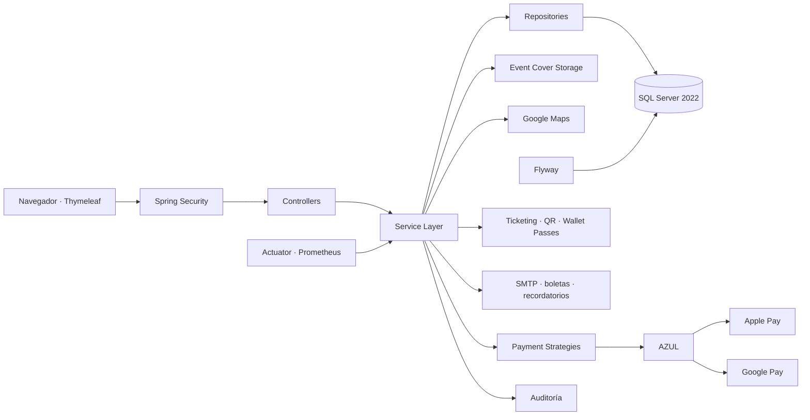

<div align="center">

<p align="center">
  
</p>

<p align="center">
  
</p>


**Plataforma web empresarial para gestión integral de eventos, reservaciones, ventas, pagos, ticketing digital y control de acceso.**

[](#-estado-del-proyecto)
[](https://github.com/Jairo0811/Eventix/actions/workflows/ci.yml)
[](https://openjdk.org/)
[](https://spring.io/projects/spring-boot)
[](https://spring.io/projects/spring-security)
[](https://www.microsoft.com/sql-server)
[](https://www.docker.com/)
[](https://www.thymeleaf.org/)
[](https://getbootstrap.com/)

> **Estado actual:** versión 1.1.2 estable y en fase de QA manual final. La aplicación incorpora recuperación segura de contraseña, perfil, promociones, liquidaciones, notificaciones transaccionales, ticketing digital, control de acceso, carga persistente de portadas, descubrimiento público de eventos, integración de Google Maps, temas claro/oscuro/sistema, una capa transversal de accesibilidad orientada a NORTIC B2:2017 / WCAG 2.0 AA, observabilidad y un pipeline integral de calidad y seguridad.

</div>

---

## 🧭 Continuidad académica

**Eventix** representa el primer proyecto de una trayectoria académica de tres asignaturas cursadas con el profesor **Raydelto Hernández Perera** en el Instituto Tecnológico de Las Américas (ITLA). La relación entre estos proyectos es **formativa y cronológica**: no son dependencias técnicas ni secuelas de una misma aplicación, sino evidencias de una progresión en distintas áreas del desarrollo de software.

La secuencia comenzó en **2017-C2** con **Programación II (SOF-004)**, donde Eventix fue desarrollado como proyecto final. Continuó en **2018-C1** con **Estructuras de Datos (SOF-012)** y el proyecto [**Aerolinea**](https://github.com/Jairo0811/Aerolinea), y culminó en **2018-C2** con **Programación WEB (SOF-011)** y [**ITLA Crush**](https://github.com/Jairo0811/ITLAcrushReact).

| Orden | Código | Asignatura | Proyecto | Período | Enfoque académico |
|---:|---|---|---|---|---|
| 1 | SOF-004 | Programación II | **Eventix** | 2017-C2 | Programación orientada a objetos, lógica de negocio y construcción de una aplicación completa |
| 2 | SOF-012 | Estructuras de Datos | [**Aerolinea**](https://github.com/Jairo0811/Aerolinea) | 2018-C1 | Estructuras de datos, modelado de relaciones y resolución de rutas |
| 3 | SOF-011 | Programación WEB | [**ITLA Crush**](https://github.com/Jairo0811/ITLAcrushReact) | 2018-C2 | Desarrollo web, JavaScript, React y Firebase |

Vistos en conjunto, los tres proyectos documentan una evolución desde la construcción de aplicaciones orientadas a objetos, pasando por estructuras y algoritmos, hasta el desarrollo de aplicaciones web modernas. Cada repositorio conserva su identidad académica original y, cuando aplica, incorpora una restauración o modernización posterior orientada a estándares profesionales y portafolio.

---

## 📌 Descripción

**Eventix** administra el ciclo completo de un evento: descubrimiento público, publicación, reservación, venta, cobro, emisión de entradas, almacenamiento en wallets digitales, validación de acceso, liquidación a organizadores, seguimiento operativo, reportes y auditoría.

La aplicación está construida como un **monolito modular por dominio**, manteniendo separación de responsabilidades entre controladores, servicios, repositorios, entidades, DTO, seguridad, infraestructura y vistas.

---

## 🆕 Últimas incorporaciones

### ♿ Accesibilidad NORTIC B2 / WCAG 2.0 AA

Eventix adopta **NORTIC B2:2017 / WCAG 2.0 Nivel AA** como objetivo interno de accesibilidad. La implementación técnica ya incorpora una capa transversal y pruebas de regresión; la conformidad global permanece sujeta al QA manual final documentado en [`docs/accessibility-nortic-b2.md`](docs/accessibility-nortic-b2.md).

- `lang="es"`, títulos descriptivos, landmarks y navegación con `aria-current`.
- Indicadores de foco `:focus-visible` reforzados para teclado.
- Mensajes de éxito/error mediante `role="status"`, `role="alert"` y regiones `aria-live`.
- Formularios de autenticación, usuarios, perfil, eventos, checkout y liquidaciones con errores asociados mediante `aria-describedby` y `aria-invalid`.
- Agrupaciones semánticas con `fieldset`/`legend` donde corresponde.
- Prevención y confirmación reforzada para operaciones financieras y destructivas.
- Soporte de `prefers-reduced-motion` y `forced-colors`.
- Protecciones de layout orientadas a zoom del navegador al 200 %.
- Estados y badges reforzados para no depender únicamente del color.
- Control de acceso QR con resultados anunciables, tablas semánticas y paginación accesible.
- Pruebas automáticas de regresión para la fundación de accesibilidad y contraste.

> La auditoría interna no equivale a una certificación oficial de OGTIC. Antes de declarar conformidad global deben completarse los recorridos manuales de teclado, zoom 200 %, medición de contraste, lector de pantalla y Light/Dark/System por rol.

### 🌓 Temas claro, oscuro y sistema

La interfaz dispone de selección persistente de apariencia y una capa específica de contraste para mantener legibilidad en los distintos temas.

- Temas `light`, `dark` y seguimiento de preferencia del sistema.
- Contraste reforzado en Dashboard, tablas, listados, formularios, checkout, ventas y liquidaciones.
- Estados `hover`, `focus`, `disabled`, `readonly`, autofill y validaciones adaptados al tema oscuro.
- Ajustes específicos para alerts, badges, botones, paginación y componentes financieros.
- Refuerzo visual en Home/Auth, reportes, QR/boletas, control de acceso y páginas de error.

### 🌐 Home público y descubrimiento de eventos

La ruta `/` presenta una **landing page pública y responsiva** con identidad visual propia y descubrimiento de eventos publicados.

- Navegación pública sin exponer módulos administrativos.
- Acceso directo al login para visitantes y Dashboard para usuarios autenticados.
- Descubrimiento de próximos eventos desde el Home.
- Login enlazado nuevamente con el Home.
- Footer corporativo con contraste y branding reforzados.
- Diseño responsive integrado con la identidad visual de Eventix.

### 🗺️ Google Maps en eventos

Los eventos pueden asociar una ubicación de Google Maps y mostrar una vista previa utilizable tanto en desarrollo como en producción.

- Integración con Google Maps Embed API cuando `GOOGLE_MAPS_EMBED_API_KEY` está configurada.
- Fallback de vista previa basado en lugar y dirección cuando no existe API key.
- Compatibilidad con enlaces completos que contienen búsqueda, destino, lugar o coordenadas.
- Conservación de enlaces compartidos/cortos para la acción **Abrir en Maps**.
- Estado de la vista previa anunciado de forma accesible.
- La API key es opcional para desarrollo y debe restringirse por dominio en producción.

### 🖼️ Portadas de eventos persistentes

- Carga manual de imágenes `JPG`, `PNG` y `WEBP` de hasta 5 MB.
- Nombres internos mediante UUID y validación MIME.
- Persistencia fuera del JAR en `data/event-covers`.
- Volumen Docker `eventix-app-data` para conservar imágenes entre recreaciones.
- Renderizado con proporciones conservadas.
- Reemplazo seguro y protección contra path traversal.

### 🏦 Liquidaciones financieras reforzadas

- Flujo de estados pendiente, procesando, pagada, fallida y cancelada.
- Formularios con validación accesible e instrucciones financieras previas.
- Confirmaciones explícitas para procesar, marcar pagada, registrar fallo y cancelar.
- Corrección del flujo JavaScript de `data-confirm` preservando el botón que originó el submit y su `formaction`.
- Prevención de doble liquidación y trazabilidad administrativa.

### 🛡️ Manejo de errores y estabilización

- Recursos inexistentes devuelven HTTP `404` mediante vista dedicada.
- Métodos HTTP no soportados se manejan como `405 Method Not Allowed` en lugar de degradarse a un falso `500`.
- Formularios sensibles mantienen CSRF activo; no se deshabilita como mecanismo de corrección.
- Páginas de error reforzadas para contraste y accesibilidad.
- Hibernate detecta automáticamente el dialecto de SQL Server.
- Eliminado el conflicto de `commons-logging` con `spring-jcl` en PDFBox.
- GitHub Actions actualizado a `actions/setup-java@v5`.
- Pipeline validado con Maven, Checkstyle, pruebas, Docker Compose, readiness, rotación de credenciales, Trivy y SBOM.

### 💳 Apple Pay y Google Pay mediante AZUL

La arquitectura de pagos incorpora soporte real para **Apple Pay** y **Google Pay** utilizando **AZUL** como procesador/adquirente.

- Apple Pay y Google Pay integrados como proveedores de wallet.
- Recepción segura de tokens de pago digitales.
- Procesamiento de cargos y reembolsos mediante AZUL.
- Cliente SOAP seguro y endpoints dedicados.
- Asociación de dominio requerida por Apple Pay.
- CSP y `Permissions-Policy` adaptadas para capacidades de pago web.
- Las wallets requieren credenciales comerciales válidas; no utilizan simulación.

### 📊 Dashboard ejecutivo renovado

El panel principal ofrece una lectura moderna del estado operativo y comercial de Eventix, incluyendo métricas de ventas, ingresos, eventos, entradas y asistencia, con contraste reforzado en temas claro y oscuro.

---

## ✨ Funcionalidades

### 🔐 Seguridad y usuarios

- Inicio y cierre de sesión con Spring Security.
- Acceso mediante correo electrónico o nombre de usuario.
- Contraseñas BCrypt y cambio obligatorio de contraseña temporal.
- Recuperación de contraseña con tokens de un solo uso, hash persistido, expiración, revocación y respuesta anti-enumeración.
- Perfil autenticado con datos básicos, cambio con contraseña actual y preferencias de notificación.
- Gestión segura de sesiones y protección CSRF.
- Autorización por rutas, servicios, roles y propiedad del recurso.
- Roles `ADMINISTRATOR`, `OPERATOR`, `ORGANIZER`, `ACCESS_STAFF` y `USER`.
- CRUD de usuarios, filtros, paginación, activación/desactivación y restablecimiento de contraseña.
- Rate limiting, CSP, HSTS, Permissions Policy e identificadores de correlación.
- Manejo diferenciado de HTTP `403`, `404`, `405` y errores internos.

### 📅 Eventos

- CRUD completo de eventos y categorías.
- Estados borrador, publicado, cancelado y finalizado.
- Fechas, lugar, dirección, capacidad, organizador y portada.
- Vista previa de Google Maps con API oficial o fallback por lugar/dirección.
- Carga manual de portadas `JPG`, `PNG` o `WEBP` de hasta 5 MB.
- Persistencia de imágenes en almacenamiento configurable y volumen Docker dedicado.
- Eventos gratuitos o de pago.
- Reglas de transición de estado y validaciones de negocio.
- Búsqueda, filtros, paginación y descubrimiento público.
- Tipos de entrada General, VIP, Preferencial, Estudiante, Cortesía y Personalizado.

### 🎟️ Reservaciones y ventas

- CRUD operativo de reservaciones con historial permanente.
- Estados pendiente, confirmada, cancelada y expirada.
- Retención temporal y liberación automática de cupos.
- Bloqueo pesimista para prevención transaccional de sobreventa.
- Prevención de reservaciones activas duplicadas.
- Ventas vinculadas a reservaciones confirmadas.
- Distribución multirrenglón de entradas con precio histórico.
- Estados de venta pendiente, pagada, reembolsada y cancelada.
- Cancelaciones y reembolsos justificados.
- Comprobantes imprimibles y exportables a PDF.
- Cupones por porcentaje o monto fijo, límites globales/por comprador, vigencia, eventos e importe mínimo calculados exclusivamente en backend.
- Snapshots de subtotal, descuento, total y cupón para reconstrucción histórica.

### 💰 Pagos

- Arquitectura desacoplada mediante patrón **Strategy**.
- Proveedores preparados para Stripe, PayPal, AZUL, CardNET, Qik y transferencia bancaria.
- Apple Pay y Google Pay procesados mediante AZUL cuando existen credenciales válidas.
- Historial permanente de intentos aprobados y rechazados.
- Cargos y reembolsos.
- Checkout reforzado con revisión previa y manejo accesible de errores.

### 📱 Ticketing y Wallets

- Emisión idempotente de una boleta digital por cada unidad de una venta pagada.
- PDF descargable y QR individual con Apache PDFBox y ZXing.
- Firma Ed25519, huella SHA-256 y código antifraude.
- Estados activa, utilizada, cancelada y vencida.
- Revocación automática por reembolso o cancelación del evento.
- Pases firmados para Apple Wallet y enlaces de guardado para Google Wallet.
- QR con superficie de alto contraste preservada para legibilidad de escáner.

### 🚪 Control de acceso

- Escáner web mediante cámara y entrada manual de respaldo.
- Validación transaccional de primer acceso y reingreso autorizado.
- Detección de duplicados, cancelaciones, falsificaciones y vencimientos.
- Bitácora de cada intento con fecha, usuario, dispositivo e IP.
- Almacenamiento únicamente de la huella del QR recibido.
- Métricas de capacidad, asistentes, pendientes, rechazados, duplicados y reingresos.
- Resultados de escaneo anunciados mediante live regions y tabla semántica de validaciones.

### 📈 Reportes, auditoría y observabilidad

- Dashboard ejecutivo y comercial.
- Reportes por evento, categoría, organizador y período.
- Ingresos mensuales, eventos más vendidos y más reservados.
- Exportación CSV, XLSX y PDF.
- Auditoría de autenticación, CRUD, ventas, reservaciones, cambios de estado, escaneos, exportaciones y errores.
- Health checks de liveness/readiness.
- Métricas Prometheus y logs JSON en producción.

### 🏦 Liquidaciones y centro del organizador

- Libro persistente de ventas, descuentos, reembolsos, comisión y neto.
- Estados transaccionales pendiente, procesando, pagada, fallida y cancelada.
- Prevención de doble liquidación mediante bloqueo e índice único filtrado.
- Confirmaciones para acciones financieras sensibles y trazabilidad administrativa.
- Centro comercial privado por organizador con ocupación, próximos eventos, rendimiento histórico y liquidaciones pendientes/pagadas.

### ✉️ Notificaciones

- Confirmaciones de reserva, compra, cancelación, reembolso y recuperación.
- Boletas PDF adjuntas; varias boletas se agrupan en un único ZIP.
- Recordatorios persistentes, deduplicados, reintentables y sujetos a preferencias.
- Entrega transaccional `AFTER_COMMIT`: un fallo SMTP no revierte una venta.

---

# 🧱 Stack tecnológico

| Área | Tecnología principal |
|---|---|
| Backend | Java 21, Spring Boot 3.5, Spring MVC, Spring Security, Spring Data JPA |
| Persistencia | SQL Server 2022, Hibernate, Flyway |
| Frontend | Thymeleaf, HTML5, CSS3, JavaScript, Bootstrap 5, Bootstrap Icons |
| Pagos | Strategy Pattern, AZUL, Apple Pay, Google Pay |
| Ticketing | Apache PDFBox, ZXing, Ed25519, Apple Wallet, Google Wallet |
| Mapas | Google Maps Embed API + fallback de vista previa |
| Observabilidad | Spring Boot Actuator, Micrometer, Prometheus, logs JSON |
| Calidad | JUnit 5, MockMvc, Testcontainers, JaCoCo, Checkstyle |
| DevOps | Git, GitHub Actions, Docker, Docker Compose, Trivy, SBOM SPDX |
| Accesibilidad | NORTIC B2:2017 / WCAG 2.0 AA como objetivo interno; QA manual final pendiente |

---

## 🏗️ Arquitectura



Flujo principal:

```text
Controller → Service → Repository → Database
```

Las integraciones externas y el almacenamiento de archivos permanecen desacoplados de las reglas centrales mediante servicios y estrategias específicas.

---

## 🧩 Principios y patrones

- Clean Code, SOLID, DRY y KISS.
- Monolito modular por dominio y MVC.
- Repository Pattern y Service Layer.
- Strategy Pattern para pasarelas de pago.
- DTO para límites entre presentación y dominio.
- Transacciones en operaciones críticas.
- Separación entre lógica de negocio e infraestructura externa.

---

## ♿ Accesibilidad y QA final

La matriz técnica y el procedimiento de validación están documentados en [`docs/accessibility-nortic-b2.md`](docs/accessibility-nortic-b2.md).

Antes del cierre definitivo deben completarse manualmente:

1. Navegación completa mediante teclado (`Tab`, `Shift+Tab`, `Enter`, `Space` y flechas).
2. Orden lógico y visibilidad del foco.
3. Recorridos completos en temas claro, oscuro y sistema.
4. Zoom del navegador al 200 % sin pérdida de contenido o funcionalidad.
5. Medición de contraste, no solo inspección visual.
6. Smoke test con lector de pantalla, recomendando NVDA en Windows.
7. Validación de errores y sugerencias correctivas en formularios.
8. Confirmación/revisión previa de operaciones financieras y destructivas.

Una auditoría interna satisfactoria permite documentar que Eventix fue **diseñado y validado internamente con NORTIC B2:2017 / WCAG 2.0 AA como referencia**; no equivale a certificación oficial de OGTIC.

---

## 🧪 Calidad y seguridad

El pipeline de Eventix valida automáticamente compilación Java 21/Maven, Checkstyle, pruebas unitarias y de integración, SQL Server mediante Testcontainers, cobertura JaCoCo, Dependency Review, Docker Compose, readiness, autenticación y headers de seguridad, persistencia/rotación de credenciales, Trivy y generación de SBOM SPDX.

Las capas recientes de accesibilidad, formularios transaccionales, Google Maps, liquidaciones y contraste Light/Dark incluyen pruebas de regresión automatizadas.

---

## 🚀 Ejecución local

### Requisitos

- Java 21.
- Maven 3.9+.
- Docker Desktop.
- Git.

```bash
git clone https://github.com/Jairo0811/Eventix.git
cd Eventix
```

Para desarrollo con Maven:

```bash
mvn clean verify
mvn spring-boot:run
```

### Configuración

Copia `.env.example` a `.env` y reemplaza los valores locales. Entre las variables relevantes se encuentran `MSSQL_SA_PASSWORD`, `EVENTIX_DB_PASSWORD`, `EVENTIX_MIGRATOR_PASSWORD`, `APP_PROFILE`, `APP_BASE_URL`, `EVENT_COVER_STORAGE_PATH`, SMTP, ticketing y las credenciales opcionales de AZUL/Wallets.

Para Maps, `GOOGLE_MAPS_EMBED_API_KEY` es opcional en desarrollo gracias al fallback por lugar/dirección; en producción se recomienda configurar una key de Google Maps Embed API restringida adecuadamente.

### Docker Compose

```bash
docker compose up --detach --build --wait --wait-timeout 300
curl --fail http://localhost:8080/actuator/health/readiness
docker compose down
```

Compose crea SQL Server, aprovisiona usuarios separados, ejecuta Flyway y espera readiness. Los volúmenes persistentes conservan la base de datos y las portadas cargadas. No uses `docker compose down --volumes` salvo que quieras eliminar los datos persistentes.

---

## 🗃️ Base de datos

- Microsoft SQL Server 2022.
- Esquema administrado mediante Flyway.
- Usuario de ejecución separado del usuario de migraciones.
- Pruebas de integración contra SQL Server real mediante Testcontainers.

---

## 🧭 Estructura principal

Los paquetes bajo `com.jairomatias.eventix` están organizados por dominio: `auth`, `profile`, `user`, `event`, `reservation`, `sale`, `promotion`, `settlement`, `payment`, `ticket`, `notification`, `reporting`, `audit`, `security`, `observability` y `shared`.

## 👥 Roles

| Rol | Alcance principal |
|---|---|
| `ADMINISTRATOR` | Configuración, usuarios, promociones, auditoría y liquidaciones. |
| `ORGANIZER` | Sus eventos, ventas, reservaciones, reportes y liquidaciones. |
| `OPERATOR` | Operación de reservaciones, ventas y pagos. |
| `ACCESS_STAFF` | Validación de acceso autorizada. |
| `USER` | Perfil y boletas asociadas a su correo. |

La visibilidad del frontend no sustituye la autorización: rutas y servicios aplican rol y propiedad del recurso para evitar IDOR.

## 🔧 Operación y diagnóstico

Consulta [`docs/operations-runbook.md`](docs/operations-runbook.md) para despliegue, SMTP, backups, restauración, rotación de claves, health checks y diagnóstico por `X-Correlation-ID`.

## 🗺️ Roadmap posterior a v1.1.2

- Completar y documentar el QA manual final NORTIC B2 / WCAG 2.0 AA.
- Integrar un proveedor comercial real de correo con métricas/SLA.
- Automatizar despliegue a un entorno administrado con TLS y gestor de secretos.
- Evaluar almacenamiento de objetos para portadas cuando se despliegue Eventix en múltiples instancias.
- Evaluar OpenTelemetry solo cuando exista infraestructura de trazas distribuida.

---

## 👤 Autor

**Francis Jairo Matías Rosario**  
Proyecto original: Programación II — ITLA, 2017-C2.  
Modernización y reconstrucción profesional: 2026.

---

## 📄 Licencia

El repositorio no declara actualmente una licencia de distribución. Todos los derechos permanecen reservados hasta que el autor publique una licencia explícita.

## 🏷️ Versiones

Consulta [`CHANGELOG.md`](CHANGELOG.md) para conocer los cambios incluidos en cada versión. El tag histórico `v1.0.0` se conserva sin reescribir; la versión de aplicación estable actual corresponde a `1.1.2`.

---
