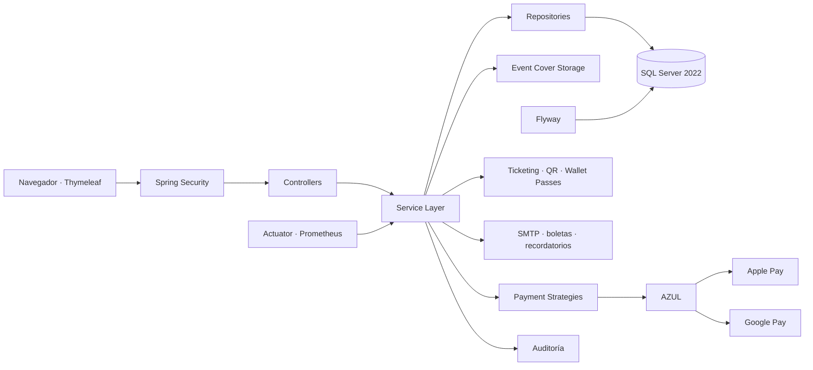

<div align="center">

<p align="center">
  
</p>

<p align="center">
  
</p>


**Plataforma web empresarial para gestión integral de eventos, reservaciones, ventas, pagos, ticketing digital y control de acceso.**

[](#-estado-del-proyecto)
[](https://github.com/Jairo0811/Eventix/actions/workflows/ci.yml)
[](https://openjdk.org/)
[](https://spring.io/projects/spring-boot)
[](https://spring.io/projects/spring-security)
[](https://www.microsoft.com/sql-server)
[](https://www.docker.com/)
[](https://www.thymeleaf.org/)
[](https://getbootstrap.com/)

> **Estado actual:** versión 1.1.2 estable y preparada como proyecto de portafolio y base para despliegue profesional. Incorpora recuperación segura de contraseña, perfil, promociones, liquidaciones, notificaciones transaccionales, ticketing digital, control de acceso, carga persistente de portadas, observabilidad y un pipeline integral de calidad y seguridad.

</div>

---

## 🧭 Continuidad académica

**Eventix** representa el primer proyecto de una trayectoria académica de tres asignaturas cursadas con el profesor **Raydelto Hernández Perera** en el Instituto Tecnológico de Las Américas (ITLA). La relación entre estos proyectos es **formativa y cronológica**: no son dependencias técnicas ni secuelas de una misma aplicación, sino evidencias de una progresión en distintas áreas del desarrollo de software.

La secuencia comenzó en **2017-C2** con **Programación II (SOF-004)**, donde Eventix fue desarrollado como proyecto final. Continuó en **2018-C1** con **Estructuras de Datos (SOF-012)** y el proyecto [**Aerolinea**](https://github.com/Jairo0811/Aerolinea), y culminó en **2018-C2** con **Programación WEB (SOF-011)** y [**ITLA Crush**](https://github.com/Jairo0811/ITLAcrushReact).

| Orden | Código | Asignatura | Proyecto | Período | Enfoque académico |
|---:|---|---|---|---|---|
| 1 | SOF-004 | Programación II | **Eventix** | 2017-C2 | Programación orientada a objetos, lógica de negocio y construcción de una aplicación completa |
| 2 | SOF-012 | Estructuras de Datos | [**Aerolinea**](https://github.com/Jairo0811/Aerolinea) | 2018-C1 | Estructuras de datos, modelado de relaciones y resolución de rutas |
| 3 | SOF-011 | Programación WEB | [**ITLA Crush**](https://github.com/Jairo0811/ITLAcrushReact) | 2018-C2 | Desarrollo web, JavaScript, React y Firebase |

Vistos en conjunto, los tres proyectos documentan una evolución desde la construcción de aplicaciones orientadas a objetos, pasando por estructuras y algoritmos, hasta el desarrollo de aplicaciones web modernas. Cada repositorio conserva su identidad académica original y, cuando aplica, incorpora una restauración o modernización posterior orientada a estándares profesionales y portafolio.

---

## 📌 Descripción

**Eventix** administra el ciclo completo de un evento: publicación, reservación, venta, cobro, emisión de entradas, almacenamiento en wallets digitales, validación de acceso, seguimiento operativo, reportes y auditoría.

La aplicación está construida como un **monolito modular por dominio**, manteniendo separación de responsabilidades entre controladores, servicios, repositorios, entidades, DTO, seguridad, infraestructura y vistas.

---

## 🆕 Últimas incorporaciones

### 🌐 Home público

La ruta `/` presenta una **landing page pública y responsiva** con identidad visual propia, propuesta de valor, módulos principales, flujo operativo y llamadas a la acción.

- Navegación pública sin exponer módulos administrativos.
- Acceso directo al login para visitantes.
- Acceso contextual al Dashboard para usuarios autenticados.
- Login enlazado nuevamente con el Home.
- Footer corporativo con mejor contraste, branding reforzado y mensaje orientado al producto.
- Diseño responsive integrado con la identidad visual de Eventix.

### 🖼️ Portadas de eventos persistentes

La gestión de eventos permite cargar la portada directamente desde el equipo del usuario, sin depender de una URL externa.

- Carga manual de imágenes `JPG`, `PNG` y `WEBP`.
- Límite de 5 MB por portada y validación del tipo MIME.
- Nombres internos generados mediante UUID.
- Persistencia fuera del JAR en `data/event-covers`.
- Volumen Docker `eventix-app-data` para conservar las imágenes entre recreaciones del contenedor.
- Renderizado con proporciones conservadas para evitar recortes innecesarios.
- Reemplazo seguro de portadas durante la edición y limpieza de archivos administrados cuando corresponde.
- Resolución defensiva de rutas para impedir traversal fuera del directorio configurado.

### 🛡️ Estabilización 1.1.2

- Recursos inexistentes devuelven HTTP `404` mediante la vista dedicada en lugar de convertirse en errores `500`.
- Hibernate detecta automáticamente el dialecto de SQL Server.
- Eliminado el conflicto de `commons-logging` con `spring-jcl` en PDFBox.
- `info.app.version` alineado con Maven en `1.1.2`.
- GitHub Actions actualizado a `actions/setup-java@v5`.
- Pipeline validado con Maven, Checkstyle, pruebas, Docker Compose, readiness, rotación de credenciales, Trivy y SBOM.

### 💳 Apple Pay y Google Pay mediante AZUL

La arquitectura de pagos incorpora soporte real para **Apple Pay** y **Google Pay** utilizando **AZUL** como procesador/adquirente.

- Apple Pay y Google Pay integrados como proveedores de wallet.
- Recepción segura de tokens de pago digitales.
- Procesamiento de cargos de wallet mediante AZUL.
- Reembolsos asociados a la transacción original.
- Cliente SOAP seguro para AZUL.
- Endpoints dedicados para pagos con wallets.
- Botones y experiencia de checkout para Apple Pay y Google Pay.
- Asociación de dominio requerida por Apple Pay.
- CSP y `Permissions-Policy` adaptadas para capacidades de pago web.
- Las wallets **no utilizan simulación**: requieren credenciales comerciales válidas para operar.

> Para producción deben configurarse las credenciales de AZUL, la validación de dominio de Apple Pay y las credenciales/habilitación correspondientes de Google Pay.

### 📊 Dashboard ejecutivo renovado

El panel principal ofrece una lectura moderna del estado operativo y comercial de Eventix, incluyendo métricas de ventas, ingresos, eventos, entradas y asistencia.

---

## ✨ Funcionalidades

### 🔐 Seguridad y usuarios

- Inicio y cierre de sesión con Spring Security.
- Acceso mediante correo electrónico o nombre de usuario.
- Contraseñas BCrypt y cambio obligatorio de contraseña temporal.
- Recuperación de contraseña con tokens de un solo uso, hash persistido,
  expiración, revocación y respuesta anti-enumeración.
- Perfil autenticado separado de administración y recuperación: datos básicos,
  cambio con contraseña actual y preferencias de notificación.
- Gestión segura de sesiones y protección CSRF.
- Autorización por rutas, servicios, roles y propiedad del recurso.
- Roles `ADMINISTRATOR`, `OPERATOR`, `ORGANIZER`, `ACCESS_STAFF` y `USER`.
- CRUD de usuarios, filtros, paginación, activación/desactivación y restablecimiento de contraseña.
- Rate limiting, CSP, HSTS, Permissions Policy e identificadores de correlación.
- Manejo diferenciado de recursos no encontrados mediante HTTP `404`.

### 📅 Eventos

- CRUD completo de eventos y categorías.
- Estados borrador, publicado, cancelado y finalizado.
- Fechas, lugar, dirección, capacidad, organizador y portada.
- Carga manual de portadas `JPG`, `PNG` o `WEBP` de hasta 5 MB.
- Persistencia de imágenes en almacenamiento configurable y volumen Docker dedicado.
- Presentación de portadas conservando sus proporciones sin recorte forzado.
- Eventos gratuitos o de pago.
- Reglas de transición de estado y validaciones de negocio.
- Búsqueda, filtros y paginación.
- Tipos de entrada General, VIP, Preferencial, Estudiante, Cortesía y Personalizado.

### 🎟️ Reservaciones y ventas

- CRUD operativo de reservaciones con historial permanente.
- Estados pendiente, confirmada, cancelada y expirada.
- Retención temporal y liberación automática de cupos.
- Bloqueo pesimista para prevención transaccional de sobreventa.
- Prevención de reservaciones activas duplicadas.
- Ventas vinculadas a reservaciones confirmadas.
- Distribución multirrenglón de entradas con precio histórico.
- Estados de venta pendiente, pagada, reembolsada y cancelada.
- Cancelaciones y reembolsos justificados.
- Comprobantes imprimibles y exportables a PDF.
- Cupones por porcentaje o monto fijo, límites globales/por comprador,
  vigencia, eventos e importe mínimo calculados exclusivamente en backend.
- Snapshots de subtotal, descuento, total y cupón para reconstrucción histórica.

### 💰 Pagos

- Arquitectura desacoplada mediante patrón **Strategy**.
- Proveedores preparados para Stripe, PayPal, AZUL, CardNET, Qik y transferencia bancaria.
- Apple Pay y Google Pay procesados mediante AZUL cuando existen credenciales válidas.
- Historial permanente de intentos aprobados y rechazados.
- Cargos y reembolsos.
- Separación entre dominio de ventas e infraestructura de pasarelas.

### 📱 Ticketing y Wallets

- Emisión idempotente de una boleta digital por cada unidad de una venta pagada.
- PDF descargable y QR individual con Apache PDFBox y ZXing.
- Firma Ed25519, huella SHA-256 y código antifraude.
- Estados activa, utilizada, cancelada y vencida.
- Revocación automática por reembolso o cancelación del evento.
- Pases firmados para **Apple Wallet**.
- Enlaces de guardado para **Google Wallet**.
- Sincronización con Google Wallet y servicio web PassKit/APNs para Apple Wallet cuando las credenciales están configuradas.

### 🚪 Control de acceso

- Escáner web mediante cámara y entrada manual de respaldo.
- Validación transaccional de primer acceso y reingreso autorizado.
- Detección de duplicados, cancelaciones, falsificaciones y vencimientos.
- Bitácora de cada intento con fecha, usuario, dispositivo e IP.
- Almacenamiento únicamente de la huella del QR recibido.
- Métricas de capacidad, asistentes, pendientes, rechazados, duplicados y reingresos.

### 📈 Reportes, auditoría y observabilidad

- Dashboard ejecutivo y comercial.
- Reportes por evento, categoría, organizador y período.
- Ingresos mensuales, eventos más vendidos y más reservados.
- Exportación CSV, XLSX y PDF.
- Auditoría de autenticación, CRUD, ventas, reservaciones, cambios de estado, escaneos, exportaciones y errores.
- Health checks de liveness/readiness.
- Métricas Prometheus y logs JSON en producción.

### 🏦 Liquidaciones y centro del organizador

- Libro persistente de ventas, descuentos, reembolsos, comisión y neto.
- Estados transaccionales pendiente, procesando, pagada, fallida y cancelada.
- Prevención de doble liquidación mediante bloqueo e índice único filtrado.
- Centro comercial privado por organizador con ocupación, próximos eventos,
  rendimiento histórico y liquidaciones pendientes/pagadas.

### ✉️ Notificaciones

- Confirmaciones de reserva, compra, cancelación, reembolso y recuperación.
- Boletas PDF adjuntas; varias boletas se agrupan en un único ZIP.
- Recordatorios persistentes, deduplicados, reintentables y sujetos a la
  preferencia del usuario.
- Entrega transaccional `AFTER_COMMIT`: un fallo SMTP no revierte una venta.

---

# 🧱 Stack tecnológico

## ⚙️ Backend

<div align="center">


</div>

| Área | Tecnología |
|---|---|
| Lenguaje | Java 21 LTS |
| Framework | Spring Boot 3.5 |
| Aplicación web | Spring MVC |
| Seguridad | Spring Security, BCrypt y CSRF |
| Persistencia | Spring Data JPA e Hibernate |
| Migraciones | Flyway |
| Mapeo | MapStruct |
| Construcción | Apache Maven |
| Documentos y QR | Apache PDFBox y ZXing |
| Criptografía | Ed25519 y Bouncy Castle |
| Archivos de portada | Spring Multipart + almacenamiento local persistente |
| Observabilidad | Spring Boot Actuator, Micrometer y Prometheus |

## 🎨 Frontend

<div align="center">


</div>

| Área | Tecnología |
|---|---|
| Motor de plantillas | Thymeleaf |
| Estructura | HTML5 |
| Estilos | CSS3 y Bootstrap 5 |
| Interactividad | JavaScript |
| Componentes visuales | Bootstrap Icons |
| Diseño | Home público, login, eventos y Dashboard responsivos con identidad visual de Eventix |

## 🗄️ Base de datos

<div align="center">


</div>

| Área | Tecnología |
|---|---|
| Motor relacional | Microsoft SQL Server 2022 o SQL Server Express |
| Driver JDBC | Microsoft JDBC Driver for SQL Server |
| Migraciones | Flyway SQL Server |
| ORM | Hibernate |
| Base para pruebas | SQL Server 2022 en Testcontainers |

## 💳 Pagos y Wallets

<div align="center">


</div>

| Área | Tecnología |
|---|---|
| Patrón | Strategy mediante `PaymentGateway` |
| Procesador | AZUL |
| Wallets de pago | Apple Pay y Google Pay |
| Wallets de ticketing | Apple Wallet y Google Wallet |
| Integración | SOAP/HTTPS, tokens de pago y APIs de wallet |

## 🧪 Pruebas y calidad

<div align="center">


</div>

| Área | Tecnología |
|---|---|
| Pruebas unitarias | JUnit 5 |
| Pruebas de integración | Spring Boot Test y MockMvc |
| Seguridad | Spring Security Test |
| Base de datos de pruebas | Microsoft SQL Server 2022 mediante Testcontainers |
| Cobertura y análisis | JaCoCo y Checkstyle |
| Seguridad de cadena | Dependency Review, Trivy y SBOM SPDX |

## 🛠️ DevOps y herramientas

<div align="center">


</div>

| Área | Tecnología |
|---|---|
| Control de versiones | Git |
| Repositorio y CI | GitHub y GitHub Actions |
| Gestión de dependencias | Maven |
| Contenedores | Docker y Docker Compose |
| Pruebas de infraestructura | Testcontainers |

---

## 🏗️ Arquitectura



Flujo principal:

```text
Controller → Service → Repository → Database
```

Las integraciones externas y el almacenamiento de archivos permanecen desacoplados de las reglas centrales mediante servicios y estrategias específicas.

---

## 🧩 Principios y patrones

- Clean Code, SOLID, DRY y KISS.
- MVC.
- Repository Pattern.
- Service Layer.
- Strategy Pattern para pasarelas de pago.
- DTO para límites entre presentación y dominio.
- Transacciones en operaciones críticas.
- Separación entre lógica de negocio e infraestructura externa.

---

## 🧪 Calidad y seguridad

El pipeline de Eventix valida automáticamente:

1. Compilación con Java 21 y Maven.
2. Checkstyle.
3. Pruebas unitarias y de integración.
4. Integración con SQL Server mediante Testcontainers.
5. Cobertura JaCoCo.
6. Dependency Review.
7. Arranque completo mediante Docker Compose.
8. Readiness, autenticación y headers de seguridad.
9. Reinicio persistente con rotación de credenciales de base de datos.
10. Escaneo de imagen con Trivy.
11. Generación de SBOM SPDX.

La estabilización **1.1.2**, el Home público y la carga persistente de portadas fueron verificados por el pipeline completo antes de incorporarse a `main`.

---

## 🚀 Ejecución local

### Requisitos

- Java 21.
- Maven 3.9+.
- Docker Desktop.
- Git.

```bash
git clone https://github.com/Jairo0811/Eventix.git
cd Eventix
```

Para desarrollo con Maven:

```bash
mvn clean verify
mvn spring-boot:run
```

### Configuración y variables de entorno

Copia el archivo de ejemplo y reemplaza sus valores locales:

```bash
cp .env.example .env
```

Variables esenciales:

| Variable | Uso |
|---|---|
| `MSSQL_SA_PASSWORD` | Inicialización de SQL Server; no la usa Eventix. |
| `EVENTIX_DB_PASSWORD` | Usuario de mínimo privilegio `eventix_app`. |
| `EVENTIX_MIGRATOR_PASSWORD` | Usuario separado `eventix_migrator`. |
| `APP_PROFILE` | `dev` local o `prod` detrás de HTTPS. |
| `APP_BASE_URL` | URL pública absoluta, usada también en recuperación. |
| `EVENT_COVER_STORAGE_PATH` | Directorio persistente para portadas; Compose usa `/app/data/event-covers`. |
| `EVENTIX_BOOTSTRAP_ADMIN_PASSWORD` | Bootstrap explícito; obligatorio si se habilita. |
| `EVENTIX_EMAIL_ENABLED` | Activa la entrega SMTP. |
| `MAIL_HOST`, `MAIL_PORT` | Endpoint SMTP. |
| `MAIL_USERNAME`, `MAIL_PASSWORD` | Credenciales SMTP, siempre externas. |
| `EVENTIX_REMINDERS_ENABLED` | Activa recordatorios cuando SMTP funciona. |
| `TICKETING_SIGNING_PRIVATE_KEY` | Clave Ed25519 persistente en producción. |

El resto de variables opcionales para AZUL, Apple/Google Wallet y Maps está
documentado en `.env.example`. Ninguna credencial real debe versionarse.

### Docker Compose

```bash
docker compose up --detach --build --wait --wait-timeout 300
curl --fail http://localhost:8080/actuator/health/readiness
docker compose down
```

Compose crea SQL Server, aprovisiona usuarios separados, ejecuta Flyway y espera
readiness. El volumen `eventix-sqlserver-data` conserva la base entre reinicios y
`eventix-app-data` conserva las portadas cargadas en `/app/data/event-covers`.
No uses `docker compose down --volumes` salvo que quieras eliminar tanto los datos
de SQL Server como los archivos persistentes de la aplicación.

Para producción configura `APP_PROFILE=prod`, una `APP_BASE_URL` HTTPS, cookies
seguras, claves Ed25519 persistentes, almacenamiento persistente para portadas y
secretos desde el gestor de la plataforma.

> Las integraciones reales con AZUL, Apple Pay, Google Pay, Apple Wallet y Google Wallet requieren credenciales externas y configuración específica del proveedor. Nunca deben almacenarse secretos reales en el repositorio.

---

## 🗃️ Base de datos

- Microsoft SQL Server 2022.
- Esquema administrado mediante Flyway.
- Usuario de ejecución separado del usuario de migraciones.
- Pruebas de integración contra SQL Server real mediante Testcontainers.

---

## 🧭 Estructura principal

Los paquetes bajo `com.jairomatias.eventix` están organizados por dominio:
`auth`, `profile`, `user`, `event`, `reservation`, `sale`, `promotion`,
`settlement`, `payment`, `ticket`, `notification`, `reporting`, `audit`,
`security`, `observability` y `shared`. Cada módulo conserva controladores,
servicios, repositorios, DTO y entidades según corresponda.

## 👥 Roles

| Rol | Alcance principal |
|---|---|
| `ADMINISTRATOR` | Configuración, usuarios, promociones, auditoría y liquidaciones. |
| `ORGANIZER` | Sus eventos, ventas, reservaciones, reportes y liquidaciones. |
| `OPERATOR` | Operación de reservaciones, ventas y pagos. |
| `ACCESS_STAFF` | Validación de acceso autorizada. |
| `USER` | Perfil y boletas asociadas a su correo. |

La visibilidad del frontend no sustituye la autorización: rutas y servicios
aplican rol y propiedad del recurso para evitar IDOR.

## 🔧 Operación y diagnóstico

Consulta [`docs/operations-runbook.md`](docs/operations-runbook.md) para
despliegue, SMTP, backups, restauración, rotación de claves, health checks y
diagnóstico por `X-Correlation-ID`.

## 🗺️ Roadmap posterior a v1.1.2

- Integrar un proveedor comercial real de correo con métricas/SLA.
- Automatizar despliegue a un entorno administrado con TLS y gestor de secretos.
- Evaluar almacenamiento de objetos para portadas cuando se despliegue Eventix en múltiples instancias.
- Evaluar OpenTelemetry solo cuando exista infraestructura de trazas distribuida.

---

## 👤 Autor

**Francis Jairo Matías Rosario**  
Proyecto original: Programación II — ITLA, 2017-C2.  
Modernización y reconstrucción profesional: 2026.

---

## 📄 Licencia

El repositorio no declara actualmente una licencia de distribución. Todos los
derechos permanecen reservados hasta que el autor publique una licencia explícita.

## 🏷️ Versiones

Consulta [`CHANGELOG.md`](CHANGELOG.md) para conocer los cambios incluidos en
cada versión. El tag histórico `v1.0.0` se conserva sin reescribir; la versión
de aplicación estable actual corresponde a `1.1.2`.

---
