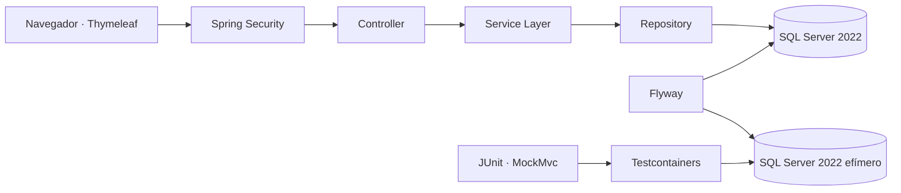

<div align="center">

<p align="center">
  
</p>

<p align="center">
  
</p>

**Eventix** es una plataforma web empresarial desarrollada con **Java 21, Spring Boot y Microsoft SQL Server**, diseñada para la administración de eventos, usuarios, reservaciones, ventas de entradas, boletas digitales y control de acceso.

[](#-estado-del-proyecto)
[](https://openjdk.org/)
[](https://spring.io/projects/spring-boot)
[](https://spring.io/projects/spring-security)
[](https://www.microsoft.com/sql-server)
[](https://www.docker.com/products/docker-desktop/)
[](https://testcontainers.com/)
[](https://www.thymeleaf.org/)
[](https://getbootstrap.com/)
[](https://maven.apache.org/)

> Estado actual: **En desarrollo. La Fase 1 está completada; los módulos operativos de eventos, reservaciones, ventas, boletas y acceso continúan pendientes.**

</div>

---

## 🧭 Continuidad académica

Programación II fue la primera de tres asignaturas cursadas con el profesor **Raydelto Hernández Perera**, dentro de una evolución progresiva en el desarrollo de software:

| Orden | Asignatura | Proyecto | Período |
|---:|---|---|---|
| 1 | Programación II | **Eventix** | 2017-C2 |
| 2 | Estructuras de Datos | [Aerolinea](https://github.com/Jairo0811/Aerolinea) | 2018-C1 |
| 3 | Programación WEB | [ITLA Crush](https://github.com/Jairo0811/ITLAcrushReact) | 2018-C2 |

Estos proyectos representan una secuencia académica enfocada en programación, estructuras de datos y desarrollo web. Actualmente están siendo preservados y modernizados como parte del portafolio profesional.

---

## 📌 Descripción

**Eventix** es una aplicación web creada como evolución profesional de un proyecto final de la asignatura **Programación II** del Instituto Tecnológico de Las Américas (ITLA).

Su objetivo es ofrecer una base sólida para administrar eventos y, en fases posteriores, incorporar reservaciones, ventas, boletas digitales, códigos QR, control de acceso, reportes y estadísticas.

La solución fue construida como un **monolito modular por dominio**, con separación clara entre controladores, servicios, repositorios, entidades, DTO y vistas.

---

## ✨ Funcionalidades disponibles

- Inicio y cierre de sesión con Spring Security.
- Acceso mediante correo electrónico o nombre de usuario.
- Contraseñas cifradas con BCrypt.
- Cambio obligatorio de contraseña temporal.
- Protección CSRF y gestión segura de sesiones.
- Autorización por roles en rutas y servicios.
- Roles iniciales:
  - `ADMINISTRATOR`
  - `OPERATOR`
  - `ORGANIZER`
  - `ACCESS_STAFF`
- Dashboard adaptado al rol del usuario.
- CRUD completo de usuarios.
- Búsqueda, filtros y paginación.
- Activación y desactivación lógica.
- Cambio de rol y estado.
- Restablecimiento seguro de contraseña.
- Auditoría técnica mediante JPA Auditing.
- Migraciones de base de datos con Flyway.
- Microsoft SQL Server como motor principal.
- Pruebas de integración sobre SQL Server real mediante Testcontainers.
- Interfaz responsiva con identidad visual verde de Eventix.
- Pruebas automatizadas de autenticación, autorización y seguridad.

---

# 🧱 Stack tecnológico

## ⚙️ Backend

<div align="center">


</div>

| Área | Tecnología |
|---|---|
| Lenguaje | Java 21 LTS |
| Framework | Spring Boot 3.5.16 |
| Aplicación web | Spring MVC |
| Seguridad | Spring Security, BCrypt y CSRF |
| Persistencia | Spring Data JPA e Hibernate |
| Migraciones | Flyway |
| Mapeo | MapStruct |
| Construcción | Apache Maven |

## 🎨 Frontend

<div align="center">


</div>

| Área | Tecnología |
|---|---|
| Motor de plantillas | Thymeleaf |
| Estructura | HTML5 |
| Estilos | CSS3 y Bootstrap 5 |
| Interactividad | JavaScript |
| Componentes visuales | Bootstrap Icons |
| Alertas | SweetAlert2 |
| Diseño | Interfaz responsiva con identidad verde de Eventix |

## 🗄️ Base de datos

<div align="center">


</div>

| Área | Tecnología |
|---|---|
| Motor relacional | Microsoft SQL Server 2022 o SQL Server Express |
| Driver JDBC | Microsoft JDBC Driver for SQL Server |
| Migraciones | Flyway SQL Server |
| ORM | Hibernate |
| Base para pruebas | SQL Server 2022 en Testcontainers |

## 🧪 Pruebas y calidad

| Área | Tecnología |
|---|---|
| Pruebas unitarias | JUnit 5 |
| Pruebas de integración | Spring Boot Test y MockMvc |
| Seguridad | Spring Security Test |
| Base de datos de pruebas | Microsoft SQL Server 2022 mediante Testcontainers |
| Aislamiento de pruebas | Contenedor efímero por ejecución |
| Integración continua | GitHub Actions con Java 21 |

## 🛠️ Herramientas de desarrollo

<div align="center">


</div>

| Área | Tecnología |
|---|---|
| Control de versiones | Git |
| Repositorio y CI | GitHub y GitHub Actions |
| Gestión de dependencias | Maven |
| Contenedores de prueba | Docker Desktop y Testcontainers |

---

## 🏗️ Arquitectura

Eventix sigue una arquitectura por capas dentro de un monolito modular:



Flujo principal:

```text
Controller → Service → Repository → Database
```

La autorización se aplica en dos niveles:

1. Las rutas web se protegen en `SecurityConfig`.
2. Las operaciones sensibles se protegen con `@PreAuthorize` en la capa de servicios.

---

## 🧩 Patrones de diseño

| Patrón | Ubicación | Propósito |
|---|---|---|
| MVC | Controladores y plantillas Thymeleaf | Separar entrada HTTP, modelo y presentación. |
| Repository | Repositorios de usuarios y roles | Abstraer la persistencia JPA. |
| Service Layer | Servicios de usuarios y dashboard | Centralizar reglas, transacciones y permisos. |
| Mapper | `UserMapper` con MapStruct | Evitar exponer entidades JPA a las vistas. |
| Strategy | Planificado para precios, pagos y cancelaciones | Resolver reglas variables de negocio. |
| Domain Events | Planificado para ventas, reservas y boletas | Desacoplar procesos entre módulos. |

---

## 📁 Estructura principal

```text
src/
├── main/
│   ├── java/com/jairomatias/eventix/
│   │   ├── auth/
│   │   ├── config/
│   │   ├── dashboard/
│   │   ├── role/
│   │   ├── security/
│   │   ├── shared/
│   │   └── user/
│   └── resources/
│       ├── db/migration/
│       ├── static/
│       ├── templates/
│       ├── application.yml
│       ├── application-dev.yml
│       └── application-prod.yml
└── test/
    ├── java/com/jairomatias/eventix/
    │   └── config/TestcontainersConfiguration.java
    └── resources/application-test.yml
```

---

## 🚦 Estado del proyecto

**Estado general: 🚧 En desarrollo — Fase 1 completada**

### Completado

- [x] Arquitectura base.
- [x] Seguridad y autenticación.
- [x] Gestión de usuarios y roles iniciales.
- [x] Dashboard por rol.
- [x] Migraciones con Flyway.
- [x] Integración con SQL Server.
- [x] Pruebas automatizadas y Testcontainers.

### Pendiente

- [ ] Gestión completa de eventos.
- [ ] Reservaciones.
- [ ] Ventas de entradas.
- [ ] Boletas digitales y códigos QR.
- [ ] Control de acceso.
- [ ] Reportes y estadísticas.

---

## 🚀 Clonar y probar Eventix

### 1. Requisitos previos

Instala y verifica:

- JDK 21.
- Maven 3.6.3 o superior.
- Microsoft SQL Server 2022 o SQL Server Express.
- SQL Server Management Studio o Azure Data Studio.
- Git.
- Docker Desktop para ejecutar las pruebas de integración con Testcontainers.
- Virtualización habilitada en BIOS/UEFI (`SVM Mode` en equipos AMD o `Intel Virtualization Technology` en equipos Intel).

```bash
java -version
mvn -version
git --version
docker version
docker ps
```

Para verificar SQL Server desde una terminal con `sqlcmd` instalado:

```bash
sqlcmd -?
```

> Docker Desktop no es obligatorio para iniciar la aplicación en desarrollo, pero sí para ejecutar la suite de integración basada en Testcontainers.

### 2. Clonar el repositorio

```bash
git clone https://github.com/Jairo0811/Eventix.git
cd Eventix
```

### 3. Crear la base de datos y el usuario técnico

Consulta la configuración incluida en el repositorio para preparar SQL Server, ejecutar las migraciones y arrancar la aplicación en el perfil correspondiente.