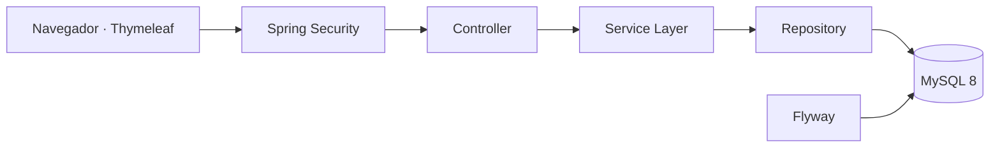

<div align="center">

# 🎟️ Eventix

### Transforma tus eventos. Conecta experiencias.

Plataforma web desarrollada en Java para gestionar eventos, usuarios, reservaciones, ventas de entradas, boletas digitales y control de acceso.

[](https://openjdk.org/)
[](https://spring.io/projects/spring-boot)
[](https://spring.io/projects/spring-security)
[](https://www.mysql.com/)
[](https://www.thymeleaf.org/)
[](https://getbootstrap.com/)
[](https://maven.apache.org/)

> Estado actual: **Fase 1 completada — arquitectura, seguridad, interfaz y gestión de usuarios.**

</div>

---

## 📌 Descripción

**Eventix** es una aplicación web creada como evolución profesional de un proyecto final de la asignatura **Programación II** del Instituto Tecnológico de Las Américas (ITLA).

Su objetivo es ofrecer una base sólida para administrar eventos y, en fases posteriores, incorporar reservaciones, ventas, boletas digitales, códigos QR, control de acceso, reportes y estadísticas.

La solución fue construida como un **monolito modular por dominio**, con separación clara entre controladores, servicios, repositorios, entidades, DTO y vistas.

---

## ✨ Funcionalidades disponibles

- Inicio y cierre de sesión con Spring Security.
- Acceso mediante correo electrónico o nombre de usuario.
- Contraseñas cifradas con BCrypt.
- Cambio obligatorio de contraseña temporal.
- Protección CSRF y gestión segura de sesiones.
- Autorización por roles en rutas y servicios.
- Roles iniciales:
  - `ADMINISTRATOR`
  - `OPERATOR`
  - `ORGANIZER`
  - `ACCESS_STAFF`
- Dashboard adaptado al rol del usuario.
- CRUD completo de usuarios.
- Búsqueda, filtros y paginación.
- Activación y desactivación lógica.
- Cambio de rol y estado.
- Restablecimiento seguro de contraseña.
- Auditoría técnica mediante JPA Auditing.
- Migraciones de base de datos con Flyway.
- Interfaz responsiva con identidad visual verde de Eventix.
- Pruebas automatizadas de autenticación, autorización y seguridad.

---

## 🧱 Stack tecnológico

<div align="center">


</div>

| Área | Tecnología |
|---|---|
| Lenguaje | Java 21 LTS |
| Backend | Spring Boot 3.5.16, Spring MVC, Spring Security |
| Persistencia | Spring Data JPA, Hibernate, MySQL 8 |
| Migraciones | Flyway |
| Vistas | Thymeleaf, HTML5, CSS3, JavaScript |
| UI | Bootstrap 5, Bootstrap Icons, SweetAlert2 |
| Mapeo | MapStruct |
| Pruebas | JUnit 5, Spring Boot Test, MockMvc, Spring Security Test, H2 |
| Construcción | Maven |
| Control de versiones | Git y GitHub |

---

## 🏗️ Arquitectura

Eventix sigue una arquitectura por capas dentro de un monolito modular:



Flujo principal:

```text
Controller → Service → Repository → Database
```

La autorización se aplica en dos niveles:

1. Las rutas web se protegen en `SecurityConfig`.
2. Las operaciones sensibles se protegen con `@PreAuthorize` en la capa de servicios.

---

## 🧩 Patrones de diseño

| Patrón | Ubicación | Propósito |
|---|---|---|
| MVC | Controladores y plantillas Thymeleaf | Separar entrada HTTP, modelo y presentación. |
| Repository | Repositorios de usuarios y roles | Abstraer la persistencia JPA. |
| Service Layer | Servicios de usuarios y dashboard | Centralizar reglas, transacciones y permisos. |
| Mapper | `UserMapper` con MapStruct | Evitar exponer entidades JPA a las vistas. |
| Strategy | Planificado para precios, pagos y cancelaciones | Resolver reglas variables de negocio. |
| Domain Events | Planificado para ventas, reservas y boletas | Desacoplar procesos entre módulos. |

---

## 📁 Estructura principal

```text
src/
├── main/
│   ├── java/com/jairomatias/eventix/
│   │   ├── auth/
│   │   ├── config/
│   │   ├── dashboard/
│   │   ├── role/
│   │   ├── security/
│   │   ├── shared/
│   │   └── user/
│   └── resources/
│       ├── db/migration/
│       ├── static/
│       ├── templates/
│       ├── application.yml
│       ├── application-dev.yml
│       └── application-prod.yml
└── test/
    ├── java/
    └── resources/application-test.yml
```

---

## ✅ Requisitos previos

Antes de ejecutar Eventix debes instalar:

- JDK 21.
- Maven 3.6.3 o superior.
- MySQL 8.
- Git.

Verifica las versiones:

```bash
java -version
mvn -version
mysql --version
```

---

## 📥 Clonar el repositorio

```bash
git clone https://github.com/Jairo0811/Eventix.git
cd Eventix
```

---

## 🗄️ Preparar MySQL

Ejecuta lo siguiente con una cuenta administradora de MySQL:

```sql
CREATE DATABASE eventix
    CHARACTER SET utf8mb4
    COLLATE utf8mb4_unicode_ci;

CREATE USER 'eventix'@'localhost' IDENTIFIED BY 'una_contraseña_segura';
GRANT ALL PRIVILEGES ON eventix.* TO 'eventix'@'localhost';
FLUSH PRIVILEGES;
```

Flyway crea las tablas y los datos iniciales al iniciar la aplicación. Hibernate solo valida el esquema y no lo modifica automáticamente.

---

## ⚙️ Configuración

Usa `.env.example` como referencia. No publiques credenciales reales.

Variables disponibles:

| Variable | Requerida | Ejemplo |
|---|---:|---|
| `DB_URL` | Sí en producción | `jdbc:mysql://localhost:3306/eventix` |
| `DB_USERNAME` | Sí | `eventix` |
| `DB_PASSWORD` | Sí | `una_contraseña_segura` |
| `APP_PORT` | No | `8080` |
| `APP_BASE_URL` | No | `http://localhost:8080` |
| `MAIL_USERNAME` | Fase futura | vacío |
| `MAIL_PASSWORD` | Fase futura | vacío |

### PowerShell

```powershell
$env:DB_URL = "jdbc:mysql://localhost:3306/eventix"
$env:DB_USERNAME = "eventix"
$env:DB_PASSWORD = "una_contraseña_segura"
mvn spring-boot:run
```

### Bash

```bash
export DB_URL=jdbc:mysql://localhost:3306/eventix
export DB_USERNAME=eventix
export DB_PASSWORD=una_contraseña_segura
mvn spring-boot:run
```

Luego abre:

```text
http://localhost:8080
```

---

## 🔐 Credenciales iniciales

| Campo | Valor |
|---|---|
| Correo | `admin@eventix.local` |
| Usuario | `admin` |
| Contraseña temporal | `Admin123*` |

El sistema obliga a cambiar la contraseña temporal en el primer inicio de sesión.

> Estas credenciales son exclusivamente para desarrollo local.

---

## ▶️ Ejecutar el proyecto

### Opción 1: Maven

```bash
mvn spring-boot:run
```

### Opción 2: Compilar y ejecutar el JAR

```bash
mvn clean package
java -jar target/eventix-0.1.0-SNAPSHOT.jar
```

### Opción 3: Ejecutar pruebas

```bash
mvn clean verify
```

Las pruebas usan una base H2 efímera en modo compatible con MySQL.

---

## 💻 IDE compatibles

<div align="center">


</div>

### Eclipse o Spring Tools Suite

1. Ve a **File → Import**.
2. Selecciona **Maven → Existing Maven Projects**.
3. Elige la carpeta que contiene `pom.xml`.
4. Ejecuta **Maven → Update Project**.
5. Configura las variables de entorno.
6. Ejecuta `EventixApplication` como **Spring Boot App** o **Java Application**.

### Apache NetBeans

1. Ve a **File → Open Project**.
2. Abre la carpeta que contiene `pom.xml`.
3. Espera a que Maven descargue las dependencias.
4. Configura las variables de entorno.
5. Ejecuta `EventixApplication`.

### IntelliJ IDEA

1. Selecciona **Open**.
2. Abre el archivo `pom.xml`.
3. Importa el proyecto como Maven.
4. Selecciona JDK 21.
5. Configura las variables de entorno.
6. Ejecuta `EventixApplication`.

El repositorio no depende de archivos exclusivos de una IDE.

---

## 🛡️ Seguridad implementada

- BCrypt con factor de costo 12.
- CSRF activo en formularios.
- Migración de sesión tras autenticación.
- Cookie de sesión `HttpOnly` y `SameSite=Lax`.
- Cookie `Secure` en el perfil de producción.
- Sesión de 30 minutos.
- Una sesión concurrente por usuario.
- Cierre de sesión con invalidación y eliminación de `JSESSIONID`.
- Estados de usuario activo, inactivo o bloqueado.
- Cambio obligatorio de contraseña temporal.
- Contraseñas temporales generadas con `SecureRandom`.
- Mensajes que no revelan si un usuario existe.
- Páginas 400, 403, 404 y 500 sin exposición de stack traces.

---

## 🧭 Roadmap

| Fase | Alcance | Estado |
|---|---|---|
| 1 | Arquitectura, configuración, base de datos, seguridad, layout, login y usuarios | ✅ Implementada |
| 2 | Categorías, lugares, organizadores, eventos, tipos de boletas e inventario | 🚧 Próxima |
| 3 | Clientes, reservaciones, expiración automática y cancelaciones | ⏳ Pendiente |
| 4 | Ventas, pagos, boletas, PDF y QR | ⏳ Pendiente |
| 5 | Control de acceso, auditoría y notificaciones | ⏳ Pendiente |
| 6 | Dashboard completo, estadísticas, reportes y exportaciones | ⏳ Pendiente |
| 7 | QA integral, Docker, diagramas y preparación de publicación | ⏳ Pendiente |

---

## 🎓 Información académica

| Información | Detalle |
|---|---|
| 👨‍🎓 Estudiante | Francis Jairo Matías Rosario |
| 🆔 Matrícula | 2015-2984 |
| 📖 Asignatura | Programación 2 (SOF-004) |
| 👨‍🏫 Profesor | Raydelto Hernández Perera |
| 🏫 Institución | Instituto Tecnológico de Las Américas (ITLA) |
| 📅 Período académico | 2017-C2 |
| 🎯 Tipo de proyecto | Proyecto final |

---

## 👨‍💻 Autor

**Jairo Matías**  
Desarrollador de Software

- GitHub: [@Jairo0811](https://github.com/Jairo0811)

---

## 📄 Licencia

El repositorio permanece privado durante el desarrollo. La licencia será definida antes de una publicación pública.
