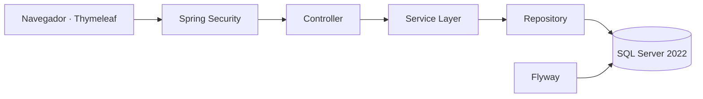

<div align="center">

<p align="center">
  
</p>

<p align="center">
  
</p>

**Eventix** es una plataforma web empresarial desarrollada con **Java 21, Spring Boot y Microsoft SQL Server**, diseñada para la administración de eventos, usuarios, reservaciones, ventas de entradas, boletas digitales y control de acceso.

[](https://openjdk.org/)
[](https://spring.io/projects/spring-boot)
[](https://spring.io/projects/spring-security)
[](https://www.microsoft.com/sql-server)
[](https://www.thymeleaf.org/)
[](https://getbootstrap.com/)
[](https://maven.apache.org/)

> Estado actual: **Fase 1 completada — arquitectura, seguridad, interfaz y gestión de usuarios.**

</div>

---

## 🧭 Continuidad académica

Programación II fue la primera de tres asignaturas cursadas con el profesor **Raydelto Hernández Perera**, dentro de una evolución progresiva en el desarrollo de software:

| Orden | Asignatura | Proyecto | Período |
|---:|---|---|---|
| 1 | Programación II | **Eventix** | 2017-C2 |
| 2 | Estructuras de Datos | [Aerolinea](https://github.com/Jairo0811/Aerolinea) | 2018-C1 |
| 3 | Programación WEB | [ITLA Crush](https://github.com/Jairo0811/ITLAcrushReact) | 2018-C2 |

Estos proyectos representan una secuencia académica enfocada en programación, estructuras de datos y desarrollo web. Actualmente están siendo preservados y modernizados como parte del portafolio profesional.

---

## 📌 Descripción

**Eventix** es una aplicación web creada como evolución profesional de un proyecto final de la asignatura **Programación II** del Instituto Tecnológico de Las Américas (ITLA).

Su objetivo es ofrecer una base sólida para administrar eventos y, en fases posteriores, incorporar reservaciones, ventas, boletas digitales, códigos QR, control de acceso, reportes y estadísticas.

La solución fue construida como un **monolito modular por dominio**, con separación clara entre controladores, servicios, repositorios, entidades, DTO y vistas.

---

## ✨ Funcionalidades disponibles

- Inicio y cierre de sesión con Spring Security.
- Acceso mediante correo electrónico o nombre de usuario.
- Contraseñas cifradas con BCrypt.
- Cambio obligatorio de contraseña temporal.
- Protección CSRF y gestión segura de sesiones.
- Autorización por roles en rutas y servicios.
- Roles iniciales:
  - `ADMINISTRATOR`
  - `OPERATOR`
  - `ORGANIZER`
  - `ACCESS_STAFF`
- Dashboard adaptado al rol del usuario.
- CRUD completo de usuarios.
- Búsqueda, filtros y paginación.
- Activación y desactivación lógica.
- Cambio de rol y estado.
- Restablecimiento seguro de contraseña.
- Auditoría técnica mediante JPA Auditing.
- Migraciones de base de datos con Flyway.
- Interfaz responsiva con identidad visual verde de Eventix.
- Pruebas automatizadas de autenticación, autorización y seguridad.

---

# 🧱 Stack tecnológico

## ⚙️ Backend

<div align="center">


</div>

| Área | Tecnología |
|---|---|
| Lenguaje | Java 21 LTS |
| Framework | Spring Boot 3.5.16 |
| Aplicación web | Spring MVC |
| Seguridad | Spring Security, BCrypt y CSRF |
| Persistencia | Spring Data JPA e Hibernate |
| Migraciones | Flyway |
| Mapeo | MapStruct |
| Construcción | Apache Maven |

## 🎨 Frontend

<div align="center">


</div>

| Área | Tecnología |
|---|---|
| Motor de plantillas | Thymeleaf |
| Estructura | HTML5 |
| Estilos | CSS3 y Bootstrap 5 |
| Interactividad | JavaScript |
| Componentes visuales | Bootstrap Icons |
| Alertas | SweetAlert2 |
| Diseño | Interfaz responsiva con identidad verde de Eventix |

## 🗄️ Base de datos

<div align="center">


</div>

| Área | Tecnología |
|---|---|
| Motor relacional | Microsoft SQL Server 2022 o SQL Server Express |
| Driver JDBC | Microsoft JDBC Driver for SQL Server |
| Migraciones | Flyway SQL Server |
| ORM | Hibernate |
| Base para pruebas | H2 |

## 🧪 Pruebas y calidad

| Área | Tecnología |
|---|---|
| Pruebas unitarias | JUnit 5 |
| Pruebas de integración | Spring Boot Test y MockMvc |
| Seguridad | Spring Security Test |
| Base de datos de pruebas | H2 |
| Integración continua | GitHub Actions con Java 21 |

## 🛠️ Herramientas de desarrollo

<div align="center">


</div>

| Área | Tecnología |
|---|---|
| Control de versiones | Git |
| Repositorio y CI | GitHub y GitHub Actions |
| Gestión de dependencias | Maven |

---

## 🏗️ Arquitectura

Eventix sigue una arquitectura por capas dentro de un monolito modular:



Flujo principal:

```text
Controller → Service → Repository → Database
```

La autorización se aplica en dos niveles:

1. Las rutas web se protegen en `SecurityConfig`.
2. Las operaciones sensibles se protegen con `@PreAuthorize` en la capa de servicios.

---

## 🧩 Patrones de diseño

| Patrón | Ubicación | Propósito |
|---|---|---|
| MVC | Controladores y plantillas Thymeleaf | Separar entrada HTTP, modelo y presentación. |
| Repository | Repositorios de usuarios y roles | Abstraer la persistencia JPA. |
| Service Layer | Servicios de usuarios y dashboard | Centralizar reglas, transacciones y permisos. |
| Mapper | `UserMapper` con MapStruct | Evitar exponer entidades JPA a las vistas. |
| Strategy | Planificado para precios, pagos y cancelaciones | Resolver reglas variables de negocio. |
| Domain Events | Planificado para ventas, reservas y boletas | Desacoplar procesos entre módulos. |

---

## 📁 Estructura principal

```text
src/
├── main/
│   ├── java/com/jairomatias/eventix/
│   │   ├── auth/
│   │   ├── config/
│   │   ├── dashboard/
│   │   ├── role/
│   │   ├── security/
│   │   ├── shared/
│   │   └── user/
│   └── resources/
│       ├── db/migration/
│       ├── static/
│       ├── templates/
│       ├── application.yml
│       ├── application-dev.yml
│       └── application-prod.yml
└── test/
    ├── java/
    └── resources/application-test.yml
```

---

## 🚀 Clonar y probar Eventix

### 1. Requisitos previos

Instala y verifica:

- JDK 21.
- Maven 3.6.3 o superior.
- Microsoft SQL Server 2022 o SQL Server Express.
- SQL Server Management Studio o Azure Data Studio.
- Git.

```bash
java -version
mvn -version
git --version
```

Para verificar SQL Server desde una terminal con `sqlcmd` instalado:

```bash
sqlcmd -?
```

### 2. Clonar el repositorio

```bash
git clone https://github.com/Jairo0811/Eventix.git
cd Eventix
```

### 3. Crear la base de datos y el usuario técnico

Ejecuta el siguiente script en SQL Server Management Studio con una cuenta administradora:

```sql
USE master;
GO

IF DB_ID(N'EventixDb') IS NULL
BEGIN
    CREATE DATABASE EventixDb;
END;
GO

IF NOT EXISTS (
    SELECT 1
    FROM sys.server_principals
    WHERE name = N'eventix_app'
)
BEGIN
    CREATE LOGIN eventix_app
    WITH PASSWORD = N'Eventix2026*',
         CHECK_POLICY = ON,
         CHECK_EXPIRATION = OFF;
END;
GO

USE EventixDb;
GO

IF NOT EXISTS (
    SELECT 1
    FROM sys.database_principals
    WHERE name = N'eventix_app'
)
BEGIN
    CREATE USER eventix_app
    FOR LOGIN eventix_app;
END;
GO

ALTER ROLE db_datareader ADD MEMBER eventix_app;
ALTER ROLE db_datawriter ADD MEMBER eventix_app;
ALTER ROLE db_ddladmin ADD MEMBER eventix_app;
GO
```

Flyway crea automáticamente las tablas, restricciones, roles y el usuario administrador al iniciar la aplicación por primera vez.

### 4. Configurar variables de entorno

Usa `.env.example` como referencia. No publiques credenciales reales.

| Variable | Requerida | Ejemplo |
|---|---:|---|
| `DB_URL` | Sí | `jdbc:sqlserver://localhost:1433;databaseName=EventixDb;encrypt=true;trustServerCertificate=true` |
| `DB_USERNAME` | Sí | `eventix_app` |
| `DB_PASSWORD` | Sí | `Eventix2026*` |
| `APP_PORT` | No | `8080` |
| `APP_BASE_URL` | No | `http://localhost:8080` |
| `MAIL_USERNAME` | Fase futura | vacío |
| `MAIL_PASSWORD` | Fase futura | vacío |

> `trustServerCertificate=true` se utiliza únicamente para facilitar el desarrollo local. En producción debe configurarse un certificado válido.

#### PowerShell

```powershell
$env:DB_URL = "jdbc:sqlserver://localhost:1433;databaseName=EventixDb;encrypt=true;trustServerCertificate=true"
$env:DB_USERNAME = "eventix_app"
$env:DB_PASSWORD = "Eventix2026*"
```

#### Bash, Linux o macOS

```bash
export DB_URL='jdbc:sqlserver://localhost:1433;databaseName=EventixDb;encrypt=true;trustServerCertificate=true'
export DB_USERNAME='eventix_app'
export DB_PASSWORD='Eventix2026*'
```

### 5. Ejecutar las pruebas

```bash
mvn clean verify
```

### 6. Iniciar la aplicación

```bash
mvn spring-boot:run
```

Abre:

```text
http://localhost:8080
```

### 7. Credenciales iniciales

| Campo | Valor |
|---|---|
| Correo | `admin@eventix.local` |
| Usuario | `admin` |
| Contraseña temporal | `Admin123*` |

El sistema obliga a cambiar la contraseña temporal en el primer inicio de sesión.

> Estas credenciales son exclusivamente para desarrollo local.

### 8. Ejecutar como archivo JAR

```bash
mvn clean package
java -jar target/eventix-0.1.0-SNAPSHOT.jar
```

### 9. Abrir en un IDE

#### Eclipse o Spring Tools

1. Abre `File > Import`.
2. Selecciona `Maven > Existing Maven Projects`.
3. Elige la carpeta clonada de Eventix.
4. Espera la descarga de dependencias.
5. Ejecuta `EventixApplication` como `Spring Boot App` o `Java Application`.

#### Apache NetBeans

1. Abre `File > Open Project`.
2. Selecciona la carpeta que contiene `pom.xml`.
3. Espera la resolución de dependencias Maven.
4. Ejecuta `EventixApplication`.

#### IntelliJ IDEA

1. Abre `File > Open`.
2. Selecciona la carpeta del repositorio.
3. Importa el proyecto como Maven.
4. Configura JDK 21.
5. Ejecuta `EventixApplication`.

### 10. Problemas frecuentes

- **Error de conexión a SQL Server:** verifica `DB_URL`, `DB_USERNAME`, `DB_PASSWORD`, el puerto `1433`, el protocolo TCP/IP y que el servicio de SQL Server esté iniciado.
- **Login rechazado:** confirma que SQL Server permita autenticación mixta y que exista el login `eventix_app`.
- **Certificado no confiable:** para desarrollo local conserva `encrypt=true;trustServerCertificate=true`; en producción instala un certificado válido.
- **Instancia SQL Server Express:** puede requerir una URL con `instanceName=SQLEXPRESS` o un puerto TCP asignado explícitamente.
- **Puerto 8080 ocupado:** define otro puerto con `APP_PORT`.
- **Versión incorrecta de Java:** confirma que `java -version` y `mvn -version` utilizan JDK 21.
- **Dependencias sin descargar:** ejecuta `mvn -U clean verify`.
- **Migraciones fallidas:** verifica que `eventix_app` tenga permisos `db_ddladmin`, `db_datareader` y `db_datawriter` sobre `EventixDb`.

---

## 🎓 Información académica

| Información | Detalle |
|---|---|
| 👨‍🎓 Estudiante | Francis Jairo Matías Rosario |
| 🆔 Matrícula | 2015-2984 |
| 📖 Asignatura | Programación 2 (SOF-004) |
| 👨‍🏫 Profesor | Raydelto Hernández Perera |
| 🏫 Institución | Instituto Tecnológico de Las Américas (ITLA) |
| 📅 Período académico | 2017-C2 |
| 🎯 Tipo de proyecto | Proyecto final |

---

## 👨‍💻 Autor

**Francis Jairo Matías Rosario**  
[GitHub](https://github.com/Jairo0811)
