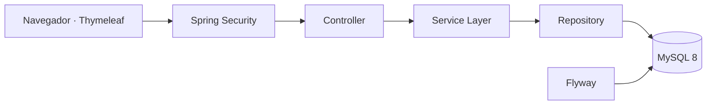

<div align="center">

<p align="center">
  
</p>

<p align="center">
  
</p>

Plataforma web desarrollada en Java para gestionar eventos, usuarios, reservaciones, ventas de entradas, boletas digitales y control de acceso.

[](https://openjdk.org/)
[](https://spring.io/projects/spring-boot)
[](https://spring.io/projects/spring-security)
[](https://www.mysql.com/)
[](https://www.thymeleaf.org/)
[](https://getbootstrap.com/)
[](https://maven.apache.org/)

> Estado actual: **Fase 1 completada — arquitectura, seguridad, interfaz y gestión de usuarios.**

</div>

---

## 🧭 Continuidad académica

Programación II fue la primera de tres asignaturas cursadas con el profesor **Raydelto Hernández Perera**, dentro de una evolución progresiva en el desarrollo de software:

| Orden | Asignatura | Proyecto | Período |
|---:|---|---|---|
| 1 | Programación II | **Eventix** | 2017-C2 |
| 2 | Estructuras de Datos | [Aerolinea](https://github.com/Jairo0811/Aerolinea) | 2018-C1 |
| 3 | Programación WEB | [ITLA Crush](https://github.com/Jairo0811/ITLAcrushReact) | 2018-C2 |

Estos proyectos representan una secuencia académica enfocada en programación, estructuras de datos y desarrollo web. Actualmente están siendo preservados y modernizados como parte del portafolio profesional.

---

## 📌 Descripción

**Eventix** es una aplicación web creada como evolución profesional de un proyecto final de la asignatura **Programación II** del Instituto Tecnológico de Las Américas (ITLA).

Su objetivo es ofrecer una base sólida para administrar eventos y, en fases posteriores, incorporar reservaciones, ventas, boletas digitales, códigos QR, control de acceso, reportes y estadísticas.

La solución fue construida como un **monolito modular por dominio**, con separación clara entre controladores, servicios, repositorios, entidades, DTO y vistas.

---

## ✨ Funcionalidades disponibles

- Inicio y cierre de sesión con Spring Security.
- Acceso mediante correo electrónico o nombre de usuario.
- Contraseñas cifradas con BCrypt.
- Cambio obligatorio de contraseña temporal.
- Protección CSRF y gestión segura de sesiones.
- Autorización por roles en rutas y servicios.
- Roles iniciales:
  - `ADMINISTRATOR`
  - `OPERATOR`
  - `ORGANIZER`
  - `ACCESS_STAFF`
- Dashboard adaptado al rol del usuario.
- CRUD completo de usuarios.
- Búsqueda, filtros y paginación.
- Activación y desactivación lógica.
- Cambio de rol y estado.
- Restablecimiento seguro de contraseña.
- Auditoría técnica mediante JPA Auditing.
- Migraciones de base de datos con Flyway.
- Interfaz responsiva con identidad visual verde de Eventix.
- Pruebas automatizadas de autenticación, autorización y seguridad.

---

# 🧱 Stack tecnológico

## ⚙️ Backend

<div align="center">


</div>

| Área | Tecnología |
|---|---|
| Lenguaje | Java 21 LTS |
| Framework | Spring Boot 3.5.16 |
| Aplicación web | Spring MVC |
| Seguridad | Spring Security, BCrypt y CSRF |
| Persistencia | Spring Data JPA e Hibernate |
| Migraciones | Flyway |
| Mapeo | MapStruct |
| Construcción | Apache Maven |

## 🎨 Frontend

<div align="center">


</div>

| Área | Tecnología |
|---|---|
| Motor de plantillas | Thymeleaf |
| Estructura | HTML5 |
| Estilos | CSS3 y Bootstrap 5 |
| Interactividad | JavaScript |
| Componentes visuales | Bootstrap Icons |
| Alertas | SweetAlert2 |
| Diseño | Interfaz responsiva con identidad verde de Eventix |

## 🗄️ Base de datos

<div align="center">


</div>

| Área | Tecnología |
|---|---|
| Motor relacional | MySQL 8 |
| Migraciones | Flyway |
| ORM | Hibernate |
| Base para pruebas | H2 en modo compatible con MySQL |

## 🧪 Pruebas y calidad

| Área | Tecnología |
|---|---|
| Pruebas unitarias | JUnit 5 |
| Pruebas de integración | Spring Boot Test y MockMvc |
| Seguridad | Spring Security Test |
| Base de datos de pruebas | H2 |
| Integración continua | GitHub Actions con Java 21 |

## 🛠️ Herramientas de desarrollo

<div align="center">


</div>

| Área | Tecnología |
|---|---|
| Control de versiones | Git |
| Repositorio y CI | GitHub y GitHub Actions |
| Gestión de dependencias | Maven |

---

## 🏗️ Arquitectura

Eventix sigue una arquitectura por capas dentro de un monolito modular:



Flujo principal:

```text
Controller → Service → Repository → Database
```

La autorización se aplica en dos niveles:

1. Las rutas web se protegen en `SecurityConfig`.
2. Las operaciones sensibles se protegen con `@PreAuthorize` en la capa de servicios.

---

## 🧩 Patrones de diseño

| Patrón | Ubicación | Propósito |
|---|---|---|
| MVC | Controladores y plantillas Thymeleaf | Separar entrada HTTP, modelo y presentación. |
| Repository | Repositorios de usuarios y roles | Abstraer la persistencia JPA. |
| Service Layer | Servicios de usuarios y dashboard | Centralizar reglas, transacciones y permisos. |
| Mapper | `UserMapper` con MapStruct | Evitar exponer entidades JPA a las vistas. |
| Strategy | Planificado para precios, pagos y cancelaciones | Resolver reglas variables de negocio. |
| Domain Events | Planificado para ventas, reservas y boletas | Desacoplar procesos entre módulos. |

---

## 📁 Estructura principal

```text
src/
├── main/
│   ├── java/com/jairomatias/eventix/
│   │   ├── auth/
│   │   ├── config/
│   │   ├── dashboard/
│   │   ├── role/
│   │   ├── security/
│   │   ├── shared/
│   │   └── user/
│   └── resources/
│       ├── db/migration/
│       ├── static/
│       ├── templates/
│       ├── application.yml
│       ├── application-dev.yml
│       └── application-prod.yml
└── test/
    ├── java/
    └── resources/application-test.yml
```

---

## ✅ Requisitos previos

Antes de ejecutar Eventix debes instalar:

- JDK 21.
- Maven 3.6.3 o superior.
- MySQL 8.
- Git.

Verifica las versiones:

```bash
java -version
mvn -version
mysql --version
```

---

## 📥 Clonar el repositorio

```bash
git clone https://github.com/Jairo0811/Eventix.git
cd Eventix
```

---

## 🗄️ Preparar MySQL

Ejecuta lo siguiente con una cuenta administradora de MySQL:

```sql
CREATE DATABASE eventix
    CHARACTER SET utf8mb4
    COLLATE utf8mb4_unicode_ci;

CREATE USER 'eventix'@'localhost' IDENTIFIED BY 'una_contraseña_segura';
GRANT ALL PRIVILEGES ON eventix.* TO 'eventix'@'localhost';
FLUSH PRIVILEGES;
```

Flyway crea las tablas y los datos iniciales al iniciar la aplicación. Hibernate solo valida el esquema y no lo modifica automáticamente.

---

## ⚙️ Configuración

Usa `.env.example` como referencia. No publiques credenciales reales.

| Variable | Requerida | Ejemplo |
|---|---:|---|
| `DB_URL` | Sí en producción | `jdbc:mysql://localhost:3306/eventix` |
| `DB_USERNAME` | Sí | `eventix` |
| `DB_PASSWORD` | Sí | `una_contraseña_segura` |
| `APP_PORT` | No | `8080` |
| `APP_BASE_URL` | No | `http://localhost:8080` |
| `MAIL_USERNAME` | Fase futura | vacío |
| `MAIL_PASSWORD` | Fase futura | vacío |

### PowerShell

```powershell
$env:DB_URL = "jdbc:mysql://localhost:3306/eventix"
$env:DB_USERNAME = "eventix"
$env:DB_PASSWORD = "una_contraseña_segura"
mvn spring-boot:run
```

### Bash

```bash
export DB_URL=jdbc:mysql://localhost:3306/eventix
export DB_USERNAME=eventix
export DB_PASSWORD=una_contraseña_segura
mvn spring-boot:run
```

Abre `http://localhost:8080`.

---

## 🔐 Credenciales iniciales

| Campo | Valor |
|---|---|
| Correo | `admin@eventix.local` |
| Usuario | `admin` |
| Contraseña temporal | `Admin123*` |

El sistema obliga a cambiar la contraseña temporal en el primer inicio de sesión.

> Estas credenciales son exclusivamente para desarrollo local.

---

## ▶️ Ejecutar el proyecto

### Opción 1: Maven

```bash
mvn spring-boot:run
```

### Opción 2: Compilar y ejecutar el JAR

```bash
mvn clean package
java -jar target/eventix-0.1.0-SNAPSHOT.jar
```

### Opción 3: Ejecutar pruebas

```bash
mvn clean verify
```

---

## 🎓 Información académica

| Información | Detalle |
|---|---|
| 👨‍🎓 Estudiante | Francis Jairo Matías Rosario |
| 🆔 Matrícula | 2015-2984 |
| 📖 Asignatura | Programación 2 (SOF-004) |
| 👨‍🏫 Profesor | Raydelto Hernández Perera |
| 🏫 Institución | Instituto Tecnológico de Las Américas (ITLA) |
| 📅 Período académico | 2017-C2 |
| 🎯 Tipo de proyecto | Proyecto final |

---

## 👨‍💻 Autor

**Francis Jairo Matías Rosario**  
[GitHub](https://github.com/Jairo0811)
