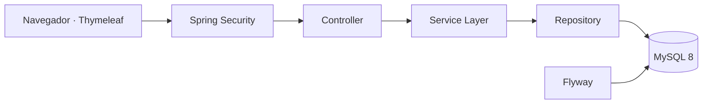

# Eventix

**Transforma tus eventos. Conecta experiencias.**

Eventix es una aplicación web desarrollada en Java para administrar eventos,
usuarios, reservaciones, ventas de entradas, boletas digitales y control de
acceso. Nace como evolución profesional de una asignación de Programación II
del Instituto Tecnológico de Las Américas (ITLA).

> Estado actual: **Fase 1 — arquitectura, seguridad, interfaz y usuarios**.

## Funcionalidad disponible

- Inicio y cierre de sesión con Spring Security.
- Acceso mediante correo electrónico o nombre de usuario.
- Contraseñas protegidas con BCrypt.
- Cambio obligatorio de contraseña temporal.
- Protección CSRF, session fixation y expiración de sesión.
- Autorización por rol en rutas y capa de servicios.
- Roles iniciales: `ADMINISTRATOR`, `OPERATOR`, `ORGANIZER` y `ACCESS_STAFF`.
- Dashboard inicial adaptado al rol.
- Gestión administrativa de usuarios:
  - listado, búsqueda, filtro y paginación;
  - creación, edición y detalle;
  - activación y desactivación lógica;
  - cambio de rol y estado;
  - restablecimiento seguro con contraseña temporal aleatoria.
- Auditoría técnica de creación y actualización mediante JPA Auditing.
- Migraciones reproducibles con Flyway.
- Interfaz responsiva con la identidad verde de Eventix.
- Pruebas de autenticación, autorización, contexto y contraseñas temporales.

## Tecnologías


| Área | Tecnología |
| --- | --- |
| Lenguaje | Java 21 LTS |
| Backend | Spring Boot 3.5.16, Spring MVC, Spring Security |
| Persistencia | Spring Data JPA, Hibernate, MySQL 8 |
| Migraciones | Flyway |
| Vistas | Thymeleaf, HTML5, CSS3, JavaScript |
| UI | Bootstrap 5, Bootstrap Icons, SweetAlert2 |
| Mapeo | MapStruct |
| Pruebas | JUnit 5, Spring Boot Test, MockMvc, Spring Security Test, H2 |
| Construcción | Maven |

## Arquitectura

Eventix utiliza un **monolito modular por dominio**. Cada módulo conserva sus
controladores, servicios, repositorios, entidades y DTO, evitando dependencias
accidentales entre responsabilidades.



Flujo obligatorio:

```text
Controller → Service → Repository → Database
```

La autorización se aplica en dos niveles:

1. Las rutas web se protegen en `SecurityConfig`.
2. Las operaciones sensibles se protegen con `@PreAuthorize` en servicios.

## Patrones aplicados

| Patrón | Ubicación | Propósito |
| --- | --- | --- |
| MVC | controladores y plantillas Thymeleaf | Separar entrada HTTP, modelo y presentación. |
| Repository | `role/repository` y `user/repository` | Abstraer la persistencia JPA. |
| Service Layer | `user/service` y `dashboard/service` | Centralizar reglas, transacciones y permisos. |
| Mapper | `UserMapper` con MapStruct | Evitar exponer entidades JPA a las vistas. |
| Strategy | planificado para precios, cancelaciones y pagos | Se incorporará donde exista variación real de negocio. |
| Domain Events | planificado para ventas, reservas y boletas | Desacoplar reacciones en fases posteriores. |

## Estructura principal

```text
src/
├── main/
│   ├── java/com/jairomatias/eventix/
│   │   ├── auth/
│   │   ├── config/
│   │   ├── dashboard/
│   │   ├── role/
│   │   ├── security/
│   │   ├── shared/
│   │   └── user/
│   └── resources/
│       ├── db/migration/
│       ├── static/
│       ├── templates/
│       ├── application.yml
│       ├── application-dev.yml
│       └── application-prod.yml
└── test/
    ├── java/
    └── resources/application-test.yml
```

## Requisitos

- JDK 21.
- Maven 3.6.3 o superior.
- MySQL 8.
- Git.

Docker no es obligatorio y se incorporará en la fase de preparación para
producción.

## Preparar MySQL

Ejecuta con una cuenta administradora de MySQL:

```sql
CREATE DATABASE eventix
    CHARACTER SET utf8mb4
    COLLATE utf8mb4_unicode_ci;

CREATE USER 'eventix'@'localhost' IDENTIFIED BY 'una_contraseña_segura';
GRANT ALL PRIVILEGES ON eventix.* TO 'eventix'@'localhost';
FLUSH PRIVILEGES;
```

Flyway crea las tablas y los datos iniciales al iniciar la aplicación. Hibernate
solo valida el esquema; no lo modifica automáticamente.

## Configuración

Copia `.env.example` como referencia y define las variables en tu sistema,
terminal o configuración de ejecución de la IDE:

| Variable | Obligatoria | Valor local predeterminado |
| --- | --- | --- |
| `DB_URL` | Producción | `jdbc:mysql://localhost:3306/eventix...` |
| `DB_USERNAME` | Producción | `eventix` |
| `DB_PASSWORD` | Producción | `eventix` |
| `APP_PORT` | No | `8080` |
| `APP_BASE_URL` | No | `http://localhost:8080` |
| `MAIL_USERNAME` | Fase futura | vacío |
| `MAIL_PASSWORD` | Fase futura | vacío |

No guardes un archivo `.env` real ni credenciales en el repositorio.

### PowerShell

```powershell
$env:DB_USERNAME = "eventix"
$env:DB_PASSWORD = "una_contraseña_segura"
mvn spring-boot:run
```

### Bash

```bash
export DB_USERNAME=eventix
export DB_PASSWORD=una_contraseña_segura
mvn spring-boot:run
```

Abre `http://localhost:8080`.

## Credenciales iniciales

| Campo | Valor |
| --- | --- |
| Correo | `admin@eventix.local` |
| Usuario | `admin` |
| Contraseña temporal | `Admin123*` |

Eventix exige cambiar la contraseña temporal en el primer inicio de sesión.
Estas credenciales son solo para desarrollo inicial.

## Compilar y probar

```bash
mvn clean verify
```

Crear el JAR ejecutable:

```bash
mvn clean package
java -jar target/eventix-0.1.0-SNAPSHOT.jar
```

Las pruebas usan una base H2 efímera en modo compatible con MySQL. La ejecución
normal siempre utiliza MySQL.

## Abrir en una IDE

### Eclipse o Spring Tools Suite

1. Selecciona **File → Import**.
2. Elige **Existing Maven Projects**.
3. Selecciona la carpeta que contiene `pom.xml`.
4. Ejecuta **Maven → Update Project**.
5. Configura las variables de entorno.
6. Ejecuta `EventixApplication` como Spring Boot App o Java Application.

### Apache NetBeans

1. Selecciona **File → Open Project**.
2. Abre la carpeta que contiene `pom.xml`.
3. Espera a que Maven descargue las dependencias.
4. Configura las variables de entorno.
5. Ejecuta `EventixApplication`.

### IntelliJ IDEA

1. Selecciona **Open** y abre `pom.xml`.
2. Importa el proyecto como Maven.
3. Selecciona JDK 21.
4. Configura las variables de entorno.
5. Ejecuta `EventixApplication`.

El repositorio no depende de archivos exclusivos de ninguna IDE.

## Seguridad implementada

- BCrypt con factor de costo 12.
- CSRF activo en formularios.
- Migración de sesión después de autenticación.
- Cookie de sesión `HttpOnly` y `SameSite=Lax`.
- Cookie `Secure` en el perfil `prod`.
- Sesión de 30 minutos.
- Una sesión concurrente por usuario.
- Cierre de sesión con invalidación y eliminación de `JSESSIONID`.
- Usuario activo, inactivo o bloqueado.
- Cambio obligatorio de contraseña temporal.
- Contraseñas temporales generadas con `SecureRandom`.
- Mensajes sin revelar si un usuario existe.
- Páginas 400, 403, 404 y 500 sin stack traces.

## Roadmap

| Fase | Alcance | Estado |
| --- | --- | --- |
| 1 | Arquitectura, configuración, base de datos, seguridad, layout, login y usuarios | Implementada |
| 2 | Categorías, lugares, organizadores, eventos, tipos de boletas e inventario | Próxima |
| 3 | Clientes, reservaciones, expiración automática y cancelaciones | Pendiente |
| 4 | Ventas, pagos, boletas, PDF y QR | Pendiente |
| 5 | Control de acceso, auditoría y notificaciones | Pendiente |
| 6 | Dashboard completo, estadísticas, reportes y exportaciones | Pendiente |
| 7 | QA integral, Docker, diagramas y preparación de publicación | Pendiente |

## Autor

**Jairo Matías**  
Evolución de proyecto académico de Programación II — ITLA.

El repositorio permanece privado durante el desarrollo. La licencia se definirá
antes de una publicación pública.
