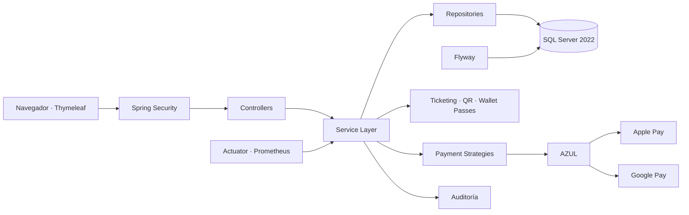

<div align="center">

<p align="center">
  
</p>

<p align="center">
  
</p>

# Eventix

**Plataforma web empresarial para gestión integral de eventos, reservaciones, ventas, pagos, ticketing digital y control de acceso.**

[](#-estado-del-proyecto)
[](https://github.com/Jairo0811/Eventix/actions/workflows/ci.yml)
[](https://openjdk.org/)
[](https://spring.io/projects/spring-boot)
[](https://spring.io/projects/spring-security)
[](https://www.microsoft.com/sql-server)
[](https://www.docker.com/)
[](https://www.thymeleaf.org/)
[](https://getbootstrap.com/)

> **Estado actual:** versión 1.0.0 completada, estabilizada y preparada como proyecto de portafolio. Incluye Home público, Dashboard ejecutivo, pagos digitales, Apple Pay, Google Pay, ticketing con QR, Wallet passes, control de acceso, reportes, auditoría y pipeline de seguridad.

</div>

---

## 🧭 Continuidad académica

Eventix nació como proyecto final de **Programación II** en el Instituto Tecnológico de Las Américas (ITLA), cursada con el profesor **Raydelto Hernández Perera** durante el período **2017-C2**.

| Orden | Asignatura | Proyecto | Período |
|---:|---|---|---|
| 1 | Programación II | **Eventix** | 2017-C2 |
| 2 | Estructuras de Datos | [Aerolinea](https://github.com/Jairo0811/Aerolinea) | 2018-C1 |
| 3 | Programación WEB | [ITLA Crush](https://github.com/Jairo0811/ITLAcrushReact) | 2018-C2 |

Actualmente Eventix ha sido reconstruido y modernizado con estándares profesionales de arquitectura, seguridad, pruebas y despliegue.

---

## 📌 Descripción

**Eventix** administra el ciclo completo de un evento: publicación, reservación, venta, cobro, emisión de entradas, almacenamiento en wallets digitales, validación de acceso, seguimiento operativo, reportes y auditoría.

La aplicación está construida como un **monolito modular por dominio**, manteniendo separación de responsabilidades entre controladores, servicios, repositorios, entidades, DTO, seguridad, infraestructura y vistas.

---

## 🆕 Últimas incorporaciones

### 🌐 Home público

La ruta `/` presenta ahora una **landing page pública y responsiva** con identidad visual propia, propuesta de valor, módulos principales, flujo operativo y llamadas a la acción.

- Navegación pública sin exponer módulos administrativos.
- Acceso directo al login para visitantes.
- Acceso contextual al Dashboard para usuarios autenticados.
- Login enlazado nuevamente con el Home.
- Diseño responsive integrado con la identidad visual de Eventix.

### 💳 Apple Pay y Google Pay mediante AZUL

La arquitectura de pagos incorpora soporte real para **Apple Pay** y **Google Pay** utilizando **AZUL** como procesador/adquirente.

- Apple Pay y Google Pay integrados como proveedores de wallet.
- Recepción segura de tokens de pago digitales.
- Procesamiento de cargos de wallet mediante AZUL.
- Reembolsos asociados a la transacción original.
- Cliente SOAP seguro para AZUL.
- Endpoints dedicados para pagos con wallets.
- Botones y experiencia de checkout para Apple Pay y Google Pay.
- Asociación de dominio requerida por Apple Pay.
- CSP y `Permissions-Policy` adaptadas para capacidades de pago web.
- Las wallets **no utilizan simulación**: requieren credenciales comerciales válidas para operar.

> Para producción deben configurarse las credenciales de AZUL, la validación de dominio de Apple Pay y las credenciales/habilitación correspondientes de Google Pay.

### 📊 Dashboard ejecutivo renovado

El panel principal ofrece una lectura moderna del estado operativo y comercial de Eventix, incluyendo métricas de ventas, ingresos, eventos, entradas y asistencia.

---

## ✨ Funcionalidades

### 🔐 Seguridad y usuarios

- Inicio y cierre de sesión con Spring Security.
- Acceso mediante correo electrónico o nombre de usuario.
- Contraseñas BCrypt y cambio obligatorio de contraseña temporal.
- Gestión segura de sesiones y protección CSRF.
- Autorización por rutas, servicios, roles y propiedad del recurso.
- Roles `ADMINISTRATOR`, `OPERATOR`, `ORGANIZER`, `ACCESS_STAFF` y `USER`.
- CRUD de usuarios, filtros, paginación, activación/desactivación y restablecimiento de contraseña.
- Rate limiting, CSP, HSTS, Permissions Policy e identificadores de correlación.

### 📅 Eventos

- CRUD completo de eventos y categorías.
- Estados borrador, publicado, cancelado y finalizado.
- Fechas, lugar, dirección, capacidad, organizador y portada.
- Eventos gratuitos o de pago.
- Reglas de transición de estado y validaciones de negocio.
- Búsqueda, filtros y paginación.
- Tipos de entrada General, VIP, Preferencial, Estudiante, Cortesía y Personalizado.

### 🎟️ Reservaciones y ventas

- CRUD operativo de reservaciones con historial permanente.
- Estados pendiente, confirmada, cancelada y expirada.
- Retención temporal y liberación automática de cupos.
- Bloqueo pesimista para prevención transaccional de sobreventa.
- Prevención de reservaciones activas duplicadas.
- Ventas vinculadas a reservaciones confirmadas.
- Distribución multirrenglón de entradas con precio histórico.
- Estados de venta pendiente, pagada, reembolsada y cancelada.
- Cancelaciones y reembolsos justificados.
- Comprobantes imprimibles y exportables a PDF.

### 💰 Pagos

- Arquitectura desacoplada mediante patrón **Strategy**.
- Proveedores preparados para Stripe, PayPal, AZUL, CardNET, Qik y transferencia bancaria.
- Apple Pay y Google Pay procesados mediante AZUL cuando existen credenciales válidas.
- Historial permanente de intentos aprobados y rechazados.
- Cargos y reembolsos.
- Separación entre dominio de ventas e infraestructura de pasarelas.

### 📱 Ticketing y Wallets

- Emisión idempotente de una boleta digital por cada unidad de una venta pagada.
- PDF descargable y QR individual con Apache PDFBox y ZXing.
- Firma Ed25519, huella SHA-256 y código antifraude.
- Estados activa, utilizada, cancelada y vencida.
- Revocación automática por reembolso o cancelación del evento.
- Pases firmados para **Apple Wallet**.
- Enlaces de guardado para **Google Wallet**.
- Sincronización con Google Wallet y servicio web PassKit/APNs para Apple Wallet cuando las credenciales están configuradas.

### 🚪 Control de acceso

- Escáner web mediante cámara y entrada manual de respaldo.
- Validación transaccional de primer acceso y reingreso autorizado.
- Detección de duplicados, cancelaciones, falsificaciones y vencimientos.
- Bitácora de cada intento con fecha, usuario, dispositivo e IP.
- Almacenamiento únicamente de la huella del QR recibido.
- Métricas de capacidad, asistentes, pendientes, rechazados, duplicados y reingresos.

### 📈 Reportes, auditoría y observabilidad

- Dashboard ejecutivo y comercial.
- Reportes por evento, categoría, organizador y período.
- Ingresos mensuales, eventos más vendidos y más reservados.
- Exportación CSV, XLSX y PDF.
- Auditoría de autenticación, CRUD, ventas, reservaciones, cambios de estado, escaneos, exportaciones y errores.
- Health checks de liveness/readiness.
- Métricas Prometheus y logs JSON en producción.

---

# 🧱 Stack tecnológico

| Área | Tecnología |
|---|---|
| Lenguaje | Java 21 LTS |
| Framework | Spring Boot 3.5 |
| Web | Spring MVC + Thymeleaf |
| Seguridad | Spring Security, BCrypt, CSRF |
| Persistencia | Spring Data JPA + Hibernate |
| Base de datos | Microsoft SQL Server 2022 |
| Migraciones | Flyway |
| Mapeo | MapStruct |
| UI | HTML5, CSS3, JavaScript, Bootstrap 5, Bootstrap Icons |
| Documentos | Apache PDFBox |
| QR | ZXing |
| Criptografía | Ed25519 + Bouncy Castle |
| Pagos | Strategy + AZUL + Apple Pay + Google Pay |
| Wallet passes | Apple Wallet + Google Wallet |
| Observabilidad | Spring Boot Actuator, Micrometer, Prometheus |
| Build | Apache Maven |
| Contenedores | Docker + Docker Compose |
| Pruebas | JUnit 5, MockMvc, Spring Security Test, Testcontainers |
| CI y seguridad | GitHub Actions, JaCoCo, Checkstyle, Dependency Review, Trivy, SBOM SPDX |

---

## 🏗️ Arquitectura



Flujo principal:

```text
Controller → Service → Repository → Database
```

Las integraciones externas permanecen desacopladas de las reglas centrales mediante servicios y estrategias específicas.

---

## 🧩 Principios y patrones

- Clean Code, SOLID, DRY y KISS.
- MVC.
- Repository Pattern.
- Service Layer.
- Strategy Pattern para pasarelas de pago.
- DTO para límites entre presentación y dominio.
- Transacciones en operaciones críticas.
- Separación entre lógica de negocio e infraestructura externa.

---

## 🧪 Calidad y seguridad

El pipeline de Eventix valida automáticamente:

1. Compilación con Java 21 y Maven.
2. Checkstyle.
3. Pruebas unitarias y de integración.
4. Integración con SQL Server mediante Testcontainers.
5. Cobertura JaCoCo.
6. Dependency Review.
7. Arranque completo mediante Docker Compose.
8. Readiness, autenticación y headers de seguridad.
9. Escaneo de imagen con Trivy.
10. Generación de SBOM SPDX.

Las integraciones de **Home público + Apple Pay + Google Pay/AZUL** fueron verificadas conjuntamente por el pipeline antes de incorporarse a `main`.

---

## 🚀 Ejecución local

### Requisitos

- Java 21.
- Maven 3.9+.
- Docker Desktop.
- Git.

```bash
git clone https://github.com/Jairo0811/Eventix.git
cd Eventix
```

Para desarrollo con Maven:

```bash
mvn clean verify
mvn spring-boot:run
```

La solución también incluye configuración Docker Compose para levantar Eventix junto con SQL Server. Deben definirse previamente las variables de entorno requeridas por la base de datos.

> Las integraciones reales con AZUL, Apple Pay, Google Pay, Apple Wallet y Google Wallet requieren credenciales externas y configuración específica del proveedor. Nunca deben almacenarse secretos reales en el repositorio.

---

## 🗃️ Base de datos

- Microsoft SQL Server 2022.
- Esquema administrado mediante Flyway.
- Usuario de ejecución separado del usuario de migraciones.
- Pruebas de integración contra SQL Server real mediante Testcontainers.

---

## 👤 Autor

**Francis Jairo Matías Rosario**  
Proyecto original: Programación II — ITLA, 2017-C2.  
Modernización y reconstrucción profesional: 2026.

---

## 📄 Licencia

Consulta el archivo `LICENSE` del repositorio para conocer los términos aplicables.

---

## 📍 Estado del proyecto

**Eventix 1.0.0 — completado y funcional.**

La reconstrucción incluye autenticación y autorización, gestión de usuarios, eventos y reservaciones, ventas y pagos, **Apple Pay y Google Pay mediante AZUL**, ticketing digital, **Apple Wallet y Google Wallet**, control de acceso, **Home público**, Dashboard ejecutivo, reportes, auditoría, observabilidad, seguridad y automatización CI.

El proyecto continúa abierto a mantenimiento, endurecimiento de producción e integración de credenciales comerciales reales, sin requerir cambios estructurales en el dominio principal.