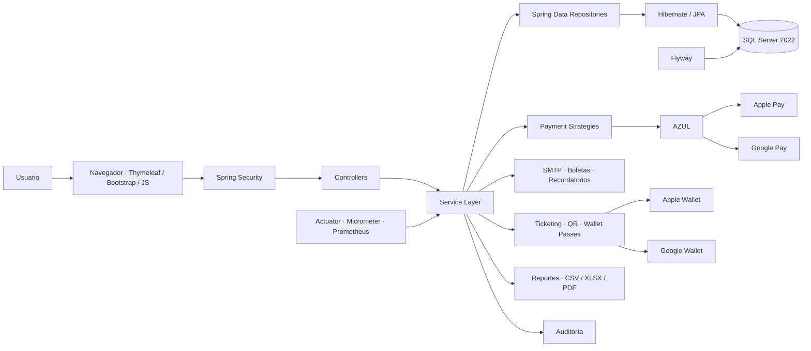
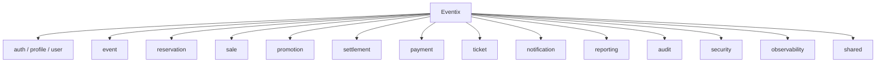
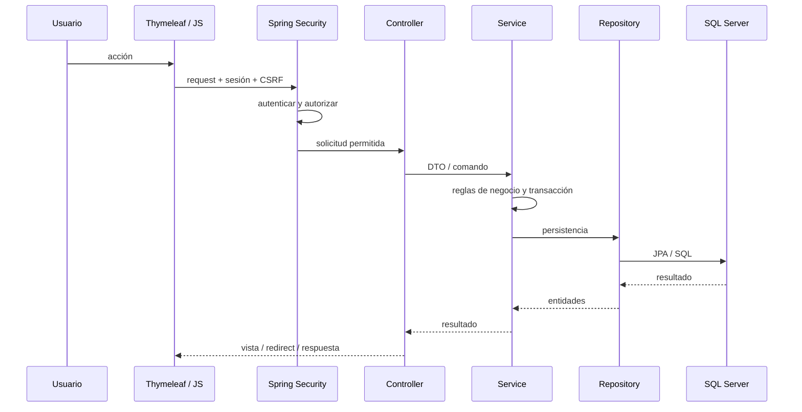
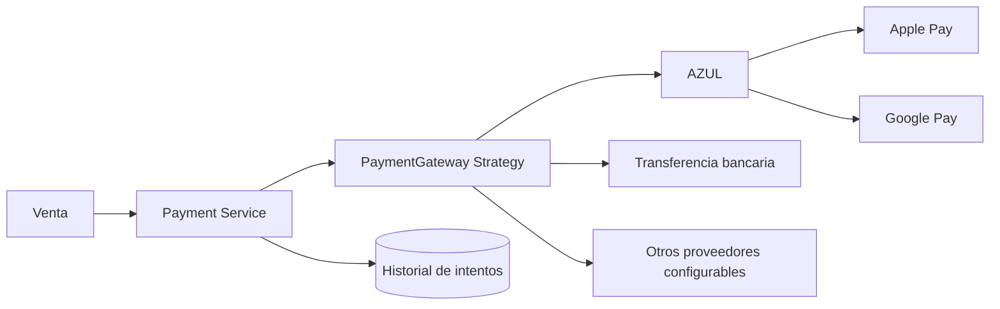
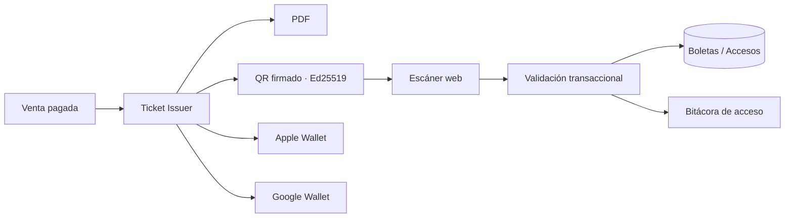
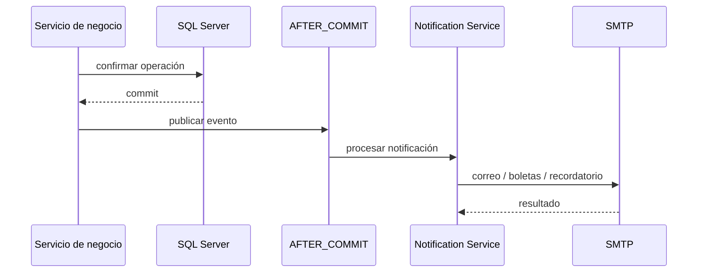
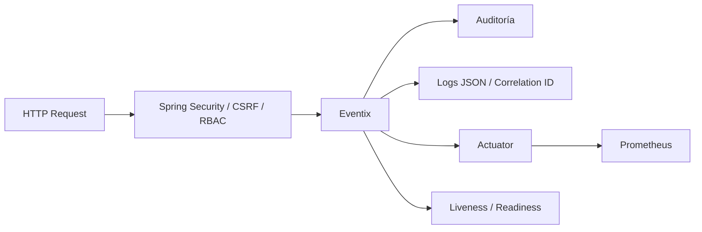

# Arquitectura de Eventix

Eventix está implementado como un **monolito modular por dominio** sobre Spring Boot. La aplicación se despliega como una sola unidad, pero cada capacidad funcional mantiene controladores, servicios, repositorios, DTO y entidades según corresponda.

## Vista general

La **Service Layer** es el centro de las reglas de negocio. Los controladores coordinan HTTP y presentación; los repositorios encapsulan persistencia; las integraciones externas se mantienen detrás de contratos y estrategias específicas.

## Módulos de dominio

Cada módulo debe mantener sus reglas dentro de su límite funcional y utilizar servicios explícitos cuando necesita colaborar con otro dominio.

## Flujo de una operación web

## Pagos

El dominio de ventas no conoce detalles SOAP ni credenciales de proveedores. La infraestructura de pago implementa las estrategias y devuelve resultados normalizados al servicio de negocio.

## Ticketing y control de acceso

La emisión es idempotente por unidad vendida y la validación protege contra duplicados, cancelaciones, falsificaciones y reutilización no autorizada.

## Notificaciones transaccionales

El envío se realiza después del commit para que un fallo temporal de correo no revierta una venta o reservación válida.

## Persistencia y migraciones

- SQL Server 2022 es la base transaccional.
- Spring Data JPA e Hibernate encapsulan acceso relacional.
- Flyway versiona el esquema y las migraciones.
- El usuario de ejecución se mantiene separado del usuario de migraciones.
- Las pruebas de integración utilizan SQL Server real mediante Testcontainers.

## Seguridad y observabilidad

## Criterio de evolución

Eventix debe permanecer como monolito modular mientras sus dominios compartan transacciones, datos y ciclo de despliegue. La extracción de servicios independientes solo tendría sentido ante necesidades reales de escalabilidad, disponibilidad o despliegue autónomo.
