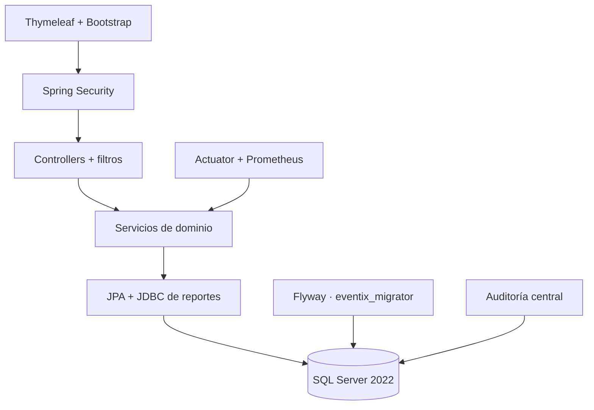
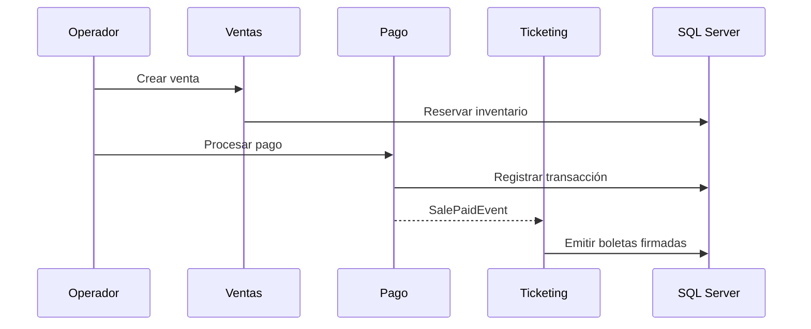

# Arquitectura de Eventix 1.0

## Estilo arquitectónico

Eventix es un monolito modular orientado a dominios. Conserva un único despliegue y una única base SQL Server, pero cada capacidad mantiene controladores, servicios, repositorios, entidades y DTO propios.

## Módulos

| Módulo | Responsabilidad |
|---|---|
| `auth`, `security` | Autenticación, sesiones, autorización, bootstrap y rate limiting. |
| `user`, `role` | Cuentas, roles, estados y credenciales temporales. |
| `category`, `event` | Catálogo y ciclo de vida de eventos. |
| `reservation` | Retenciones, disponibilidad, confirmación y expiración. |
| `sale`, `payment` | Inventario comercial, ventas, pagos y reembolsos. |
| `ticket`, `access` | Boletas, QR, firma, Wallet y control de acceso. |
| `reporting` | Agregaciones, filtros y exportaciones CSV/XLSX/PDF. |
| `audit` | Bitácora central consultable y aislada transaccionalmente. |
| `observability` | Correlación, health checks, métricas y logs estructurados. |

## Flujos críticos

### Venta y emisión

### Escaneo

El QR se analiza, se valida con la clave pública correspondiente a su `key-id`, se bloquea la boleta de forma pesimista y se registra el resultado. La base de datos solo conserva la huella SHA-256 del código recibido.

## Límites de seguridad

- El navegador nunca accede directamente a SQL Server.
- `eventix_app` solo lee y escribe datos; `eventix_migrator` aplica DDL.
- La clave privada Ed25519 se recibe desde el entorno y no se persiste en SQL.
- Los organizadores quedan restringidos a sus eventos en rutas y servicios.
- La auditoría evita registrar contraseñas, cuerpos de formularios y QR sin procesar.

## Decisiones técnicas

- JDBC se usa solo para agregaciones analíticas de lectura; el dominio transaccional permanece en JPA.
- El rate limiting en memoria es apropiado para una instancia. Un despliegue horizontal debe sustituirlo por un almacén distribuido.
- Google Wallet y Apple Wallet se activan únicamente con credenciales y certificados reales.
- Las migraciones aplicadas V1–V6 son inmutables; la Fase 6 agrega V7.
