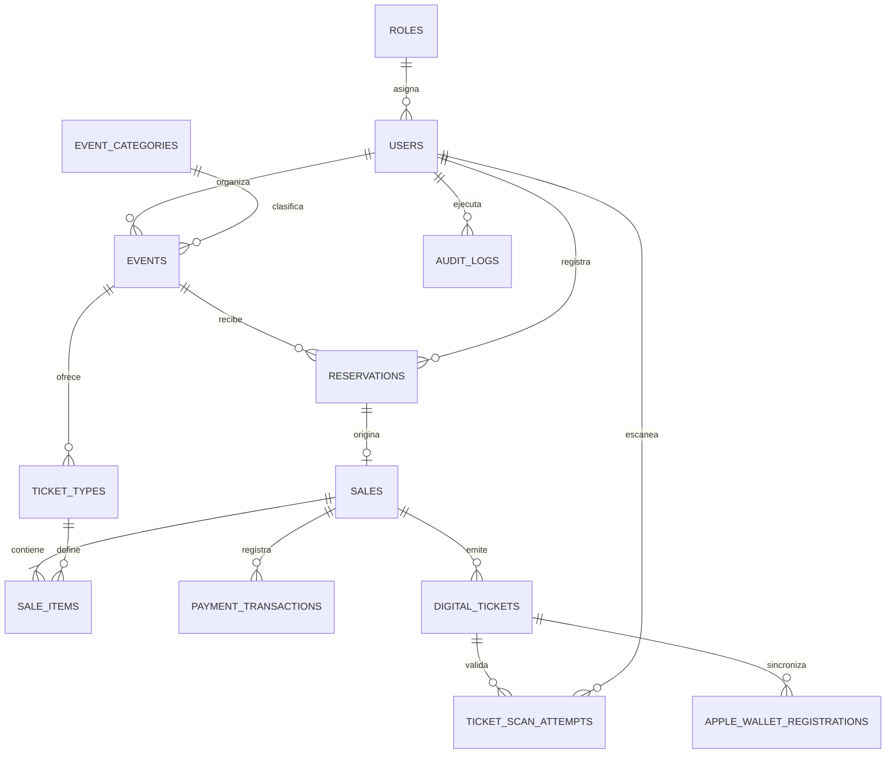

# Modelo entidad-relación

## Reglas de integridad principales

- Una reservación solo puede producir una venta.
- Cada unidad vendida produce una boleta y la secuencia es única dentro de la venta.
- El código único y el código antifraude de cada boleta son irrepetibles.
- Las cantidades, capacidades y montos tienen restricciones `CHECK`.
- Los estados válidos se restringen en SQL y en enumeraciones Java.
- `version` habilita control optimista; los flujos de inventario y escaneo agregan bloqueo pesimista.
- `audit_logs` es append-only desde la aplicación: no existe interfaz para modificar o eliminar registros.

Las definiciones autoritativas están en `src/main/resources/db/migration/V1` a `V7`.
