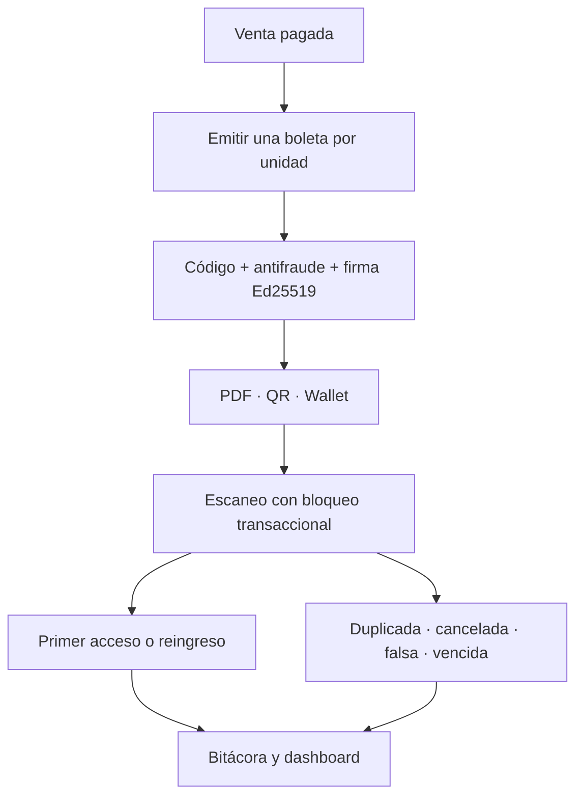

# Fase 5 — Boletas digitales y control de acceso

La Fase 5 convierte cada unidad de una venta pagada en una boleta digital verificable y añade operación de puerta con trazabilidad. La emisión PDF/QR funciona sin proveedores externos; las integraciones de wallet se activan únicamente cuando sus credenciales están completas.

## Flujo funcional



- `SalePaidEvent` emite las boletas dentro de la misma transacción. La restricción única `(sale_id, sequence_number)` y la comprobación previa hacen la operación idempotente.
- `SaleRefundedEvent` revoca las boletas vinculadas.
- Un cambio del evento actualiza la versión de los pases; si el evento se cancela, las boletas también se cancelan.
- Un proceso periódico vence boletas activas después de la hora final del evento.

## Seguridad del QR

El contenido tiene la forma:

```text
EVX1.<uniqueCode>.<antiFraudCode>.<base64urlEd25519Signature>
```

La firma cubre una representación canónica con versión, código de boleta, referencia de venta, evento, correo normalizado, tipo de entrada, secuencia, fecha de emisión y código antifraude. Antes de autorizar un acceso se comprueban:

1. formato y tamaño del token;
2. existencia del código bajo bloqueo pesimista;
3. coincidencia del código antifraude y de la firma almacenada;
4. huella SHA-256 del payload canónico con comparación resistente a diferencias de tiempo;
5. verificación criptográfica de la firma Ed25519;
6. estado de la boleta y vigencia del evento.

La bitácora no guarda el QR recibido: conserva únicamente su SHA-256 junto con resultado, fecha y hora, usuario, identificador de dispositivo e IP. El bloqueo de la fila evita que dos puertas acepten simultáneamente el mismo primer acceso.

## Modelo de datos

La migración `V6__create_digital_ticketing_and_access_schema.sql` crea:

| Tabla | Responsabilidad |
|---|---|
| `digital_tickets` | Identidad, propietario, evento, estado, firma, antifraude y versión del pase. |
| `ticket_scan_attempts` | Bitácora inmutable de aceptaciones y rechazos. |
| `apple_wallet_registrations` | Dispositivos registrados para actualizaciones PassKit/APNs. |

Los resultados de escaneo son `VALID`, `REENTRY`, `DUPLICATE`, `CANCELLED`, `COUNTERFEIT` y `EXPIRED`. Solo los dos primeros autorizan entrada.

## Permisos

| Operación | Administrador | Operador | Organizador | Personal de acceso |
|---|:---:|:---:|:---:|:---:|
| Consultar/descargar boletas | Sí | Sí | Solo sus eventos | No |
| Consultar dashboard de acceso | Sí | Sí | Solo sus eventos | Sí |
| Escanear y autorizar reingreso | Sí | Sí | No | Sí |
| Administrar credenciales wallet | Configuración externa | No | No | No |

El servicio web público de Apple está fuera de la sesión web, ignora CSRF y autentica cada pase mediante `Authorization: ApplePass <token>`. Las demás rutas mantienen CSRF y autorización de Spring Security.

## Claves Ed25519

Genera un par fuera del repositorio:

```bash
openssl genpkey -algorithm Ed25519 -out eventix-ed25519-private.pem
openssl pkey -in eventix-ed25519-private.pem -pubout -out eventix-ed25519-public.pem
openssl pkcs8 -topk8 -nocrypt -in eventix-ed25519-private.pem -outform DER | base64
openssl pkey -pubin -in eventix-ed25519-public.pem -outform DER | base64
```

Configura las dos salidas Base64:

```text
TICKETING_SIGNING_KEY_ID=eventix-prod-2026
TICKETING_SIGNING_PRIVATE_KEY=<PKCS8 DER en Base64>
TICKETING_SIGNING_PUBLIC_KEY=<X509 DER en Base64>
TICKETING_ALLOW_EPHEMERAL_SIGNING_KEY=false
TICKETING_ALLOW_REENTRY=false
TICKETING_EXPIRATION_SCAN_INTERVAL=PT5M
```

Rotar la clave exige conservar la clave pública anterior mientras existan boletas firmadas con ella. La versión actual valida contra la clave activa, por lo que la rotación debe programarse junto con soporte de múltiples `signature_key_id` antes de producción.

## Google Wallet

Variables necesarias:

```text
GOOGLE_WALLET_ENABLED=true
GOOGLE_WALLET_ISSUER_ID=<issuer id>
GOOGLE_WALLET_SERVICE_ACCOUNT_JSON=<JSON literal o base64:<JSON en Base64>>
GOOGLE_WALLET_ORIGINS=https://eventix.example.com
```

Eventix genera un JWT RS256 para “Save to Google Wallet” con una clase por evento y un objeto por boleta. Al cambiar estado, fecha o lugar intenta aplicar `PATCH` a la clase y al objeto ya guardados. El service account debe pertenecer al emisor y tener acceso a la Google Wallet API.

## Apple Wallet

Variables necesarias:

```text
APPLE_WALLET_ENABLED=true
APPLE_WALLET_PASS_TYPE_IDENTIFIER=pass.com.example.eventix
APPLE_WALLET_TEAM_IDENTIFIER=<team id>
APPLE_WALLET_CERTIFICATE_P12=<P12 en Base64>
APPLE_WALLET_CERTIFICATE_PASSWORD=<secreto>
APPLE_WALLET_WWDR_CERTIFICATE=<certificado WWDR PEM o Base64>
APPLE_WALLET_WEB_SERVICE_URL=https://eventix.example.com/api/wallet/apple/v1
APPLE_WALLET_APNS_ENABLED=true
APPLE_WALLET_APNS_PRODUCTION=true
```

El `.pkpass` contiene `pass.json`, iconos, manifiesto SHA-1 y firma CMS separada con el certificado Pass Type ID y la cadena WWDR. El servicio implementa registro y baja de dispositivos, consulta incremental de seriales, descarga de la última versión y diagnóstico. APNs es opcional; sin él el pase sigue siendo descargable, pero las actualizaciones no se notifican de inmediato.

Nunca guardes service accounts, P12, contraseñas, claves privadas o certificados reales en Git. Usa secretos del entorno de despliegue.

## Operación del escáner

- La cámara usa la API nativa `BarcodeDetector` cuando el navegador la ofrece y siempre mantiene entrada manual como respaldo.
- La cámara requiere HTTPS fuera de `localhost`.
- “Autorizar como reingreso” solo produce `REENTRY` cuando `TICKETING_ALLOW_REENTRY=true`; de lo contrario se registra `DUPLICATE`.
- Seleccionar un evento filtra métricas y bitácora. Los QR desconocidos no se atribuyen a un evento hasta que exista una boleta verificable.

## Verificación

```bash
mvn clean test
mvn clean verify
docker compose up --detach --build --wait --wait-timeout 300
curl --fail http://localhost:8080/login
```

La suite cubre firma y manipulación, emisión idempotente, primer acceso, duplicados, QR/PDF, autorización web y la migración real sobre SQL Server 2022 con Testcontainers.
